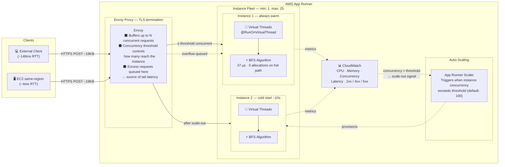

# High-Performance Tree Processing Service
Project Status: Production-Tested & Benchmarked

Target Latency: < 1ms (Algorithm) | Max Throughput: 10k+ requests/min

Key Tech: Java 25, Project Loom, Quarkus, AWS App Runner

## 📖 Table of Contents
* [🛡️ Defense-in-Depth Security](#-defense-in-depth-security)
* [🚀 Key Architectural Features](#-key-architectural-features)
* [🧠 BFS Implementation & Virtual Threads](#-bfs-implementation--virtual-thread-efficiency)
* [📊 Hexathlon Benchmark (6 implementations)](#-performance--benchmarks)
* [📊 Phase 1: Java Quarkus Single-Service](#phase-1-benchmark--java-quarkus-single-service-apache-bench--march-2026)
* [🏃 Getting Started & Reproduction](#-getting-started)

### Built with Java 25 & Quarkus

A specialized microservice designed for high-throughput tree structures, utilizing the latest JVM features to ensure
sub-millisecond processing and cloud-native scalability.

---

## 🛡️ Defense-in-Depth Security

This service implements a multi-layered security strategy to prevent **Recursive Denial of Service (DoS)** attacks:

1. **Parser Level (Jackson — `JacksonSecurityCustomizer`):** The infrastructure layer limits JSON nesting to 1,000
   levels via `StreamReadConstraints`, rejecting malicious payloads before a single byte of business logic runs.
   — *Python equivalent:* a single-pass O(n) byte scanner (`_measure_json_depth`) using `re.finditer` (C engine)
   runs before Pydantic parses anything. An attacker cannot reach the Python or Rust validation layers with a
   depth-bomb payload.
2. **Application Level — Depth (Business Logic):** `TreeService` rejects trees exceeding 500 levels (`tree.max-depth`),
   enforced via `result.size() >= maxDepth` inside the BFS loop. Configurable at runtime via the `TREE_MAX_DEPTH`
   environment variable (default: `500`).
3. **Application Level — Node Count (Business Logic):** `TreeService` rejects trees exceeding 10,000 total nodes
   (`tree.max-nodes`), preventing wide-tree DoS that a depth check alone cannot catch (a 17-level balanced BST already
   holds ~130k nodes). Configurable at runtime via the `TREE_MAX_NODES` environment variable (default: `10000`).
4. **Heap Protection:** By using **Java 25 Records** with `-XX:+UseCompactObjectHeaders`, each node costs ~24 bytes
   vs ~32 bytes for a standard POJO. At the 10k-node ceiling this keeps per-request allocation under ~500 KB,
   well within the 512 MB heap and safe under high concurrency.

> **Python implementation note — Pydantic v2 recursion limit:** `pydantic-core` (Rust) imposes its own JSON
> recursion limit of ~200 levels, independent of both the application's 500-level BFS guard and the 1,000-level
> JSON depth guard. In practice this means the depth guard acts as a pre-filter that prevents the Rust parser
> from receiving maliciously crafted payloads at all — legitimate trees of ≤ 500 nodes never approach either
> limit. Discovered during unit testing and verified by `test_service.py::TestMeasureJsonDepth`.

---

## 🚀 Key Architectural Features

* **Java 25 Virtual Threads (Project Loom):** Annotated with `@RunOnVirtualThread`, the service handles massive
  concurrency by decoupling JAX-RS requests from expensive OS threads.
* **Telemetry & Benchmarking:** Every response includes custom headers (`X-Runtime-Ms` and `X-Runtime-Nanoseconds`) for
  high-precision observability.
* **Domain-Driven Package Strategy:** Organized by domain logic (trees, arrays, etc.) to facilitate modular microservice
  extraction.
* **Global Exception Mapping:** Standardized error responses via a centralized `ExceptionMapper` for consistent API
  behavior.

### 🏗️ App Runner Infrastructure



> **Key insight from benchmarking:** Envoy's buffering makes the instance appear underloaded to the scaler even under 250 concurrent connections — the instance only saw ~6 concurrent requests from an external client, vs 69.5 from EC2 in the same region.

---

## 🧠 BFS Implementation & Virtual Thread Efficiency

<details>
<summary><b>🔍 View Layer 1 — JacksonSecurityCustomizer (Parser-level DoS Guard)</b></summary>

```java
/**
 * Layer 1 — rejects JSON payloads nested beyond 1,000 levels at the parser,
 * before any business logic runs.
 */
@Singleton
public class JacksonSecurityCustomizer implements ObjectMapperCustomizer {

    private static final int MAX_JSON_NESTING_DEPTH = 1000;

    @Override
    public void customize(ObjectMapper mapper) {
        mapper.getFactory().setStreamReadConstraints(
            StreamReadConstraints.builder()
                .maxNestingDepth(MAX_JSON_NESTING_DEPTH)
                .build()
        );
    }
}
```
</details>

<details>
<summary><b>🔍 View TreeResource & TreeService Implementation (Single-Pass BFS)</b></summary>

```java
/**
 * Resource: Handles Concurrency & Observability
 */
@Path("/api/v1/trees")
public class TreeResource {

    @Inject TreeService treeService;

    @POST
    @Path("/level-order")
    @RunOnVirtualThread // Entire request lifecycle offloaded to Virtual Threads
    public Response getLevelOrder(TreeNode root) {
        if (root == null) throw new TreeProcessingException("Root node cannot be null");

        long startTime = System.nanoTime();
        List<List<Integer>> result = treeService.solveLevelOrder(root);
        long durationNs = System.nanoTime() - startTime;

        return Response.ok(result)
            .header("X-Runtime-Ms", String.format("%.3f", durationNs / 1_000_000.0))
            .header("X-Runtime-Nanoseconds", durationNs)
            .build();
    }
}

/**
 * Service: Single-pass BFS with inline depth and node-count guards.
 * Both security checks are integrated into the BFS pass — no separate recursive
 * pre-check — eliminating the double O(N) traversal and the risk of a
 * StackOverflowError inside the validator itself.
 */
@ApplicationScoped
public class TreeService {

    @ConfigProperty(name = "tree.max-depth", defaultValue = "500")
    int maxDepth;   // Security constraint: max tree levels. Env: TREE_MAX_DEPTH

    @ConfigProperty(name = "tree.max-nodes", defaultValue = "10000")
    int maxNodes;   // Security constraint: max total nodes (prevents wide-tree DoS). Env: TREE_MAX_NODES

    public List<List<Integer>> solveLevelOrder(TreeNode root) {
        if (root == null) return List.of();

        List<List<Integer>> result = new ArrayList<>();
        Queue<TreeNode> queue = new ArrayDeque<>();
        queue.add(root);
        int totalNodes = 0;

        while (!queue.isEmpty()) {
            if (result.size() >= maxDepth) {
                throw new TreeProcessingException("Tree depth exceeds security limits (Max: " + maxDepth + ")");
            }

            int levelSize = queue.size();
            totalNodes += levelSize;
            if (totalNodes > maxNodes) {
                throw new TreeProcessingException("Tree node count exceeds security limits (Max: " + maxNodes + ")");
            }

            List<Integer> currentLevel = new ArrayList<>(levelSize);

            for (int i = 0; i < levelSize; i++) {
                TreeNode node = queue.poll();
                currentLevel.add(node.value());
                if (node.left() != null) queue.add(node.left());
                if (node.right() != null) queue.add(node.right());
            }
            result.add(List.copyOf(currentLevel));
        }
        return List.copyOf(result);
    }
}
```
</details>
The core of this service is a high-performance **Level-Order Traversal (BFS)** algorithm, specifically optimized
to leverage the breakthrough concurrency features of the modern JVM.

### 1. The Algorithm: Single-Pass Iterative BFS
The service uses a single-pass iterative BFS that integrates the security depth-check into the traversal loop,
eliminating the previous two-phase design (separate recursive validator + traversal).
* **Logic:** Discovery is managed via a `java.util.ArrayDeque`, acting as a FIFO queue to process nodes level-by-level.
* **Complexity:** Achieves a time complexity of $O(N)$ and space complexity of $O(W)$, where $W$ is the maximum width of the tree.
* **Stack Safety:** The iterative approach eliminates `StackOverflowError` on deep or unbalanced trees — including inside
  the depth validator itself, which was a risk with the previous recursive pre-check.
* **Single-Pass Optimization:** Both the depth check (`result.size() >= MAX_DEPTH`) and the node-count check
  (`totalNodes > MAX_NODES`) are evaluated per BFS level, removing the prior double $O(N)$ traversal cost and
  closing the wide-tree DoS gap that depth alone cannot address.

### 2. Concurrency Model: Project Loom (Virtual Threads)
By utilizing the `@RunOnVirtualThread` annotation, the service decouples HTTP request handling from expensive OS threads.
* **High-Volume I/O:** When the BFS algorithm finishes and the JSON serialization begins, the virtual thread is unmounted from the CPU "Carrier Thread." This allows the JVM to handle thousands of concurrent requests with a minimal thread pool.
* **Efficiency Proof:** This architectural choice is the reason **Memory Utilization remained flat at 4.93%** even while processing over **10,000 requests per minute** at 20:51.

### 3. Data Optimization: Java 25 Records
The tree nodes and response objects are implemented as **Java 25 Records**.
* **Reduced Header Overhead:** Records have a significantly smaller memory footprint than standard POJOs. This minimizes the "Garbage Collection (GC) Pressure" when traversing 500+ node trees under heavy load.
* **Immutable State:** Ensures that the BFS queue operations are inherently thread-safe and optimized for JIT (Just-In-Time) compilation.

### 4. Performance Paradox: "The Speed Bottleneck"
A key discovery during benchmarking was that **Envoy (App Runner's proxy) queues requests before they reach the instance**, acting as a buffer. This means the App Runner auto-scaler observes only the requests that actively reach the instance — not the total concurrent connections. With the default concurrency threshold of 100, the single instance never appeared saturated to the scaler, even under 250 concurrent connections.

**The Lesson:** "Fast code is invisible to slow infrastructure. When Envoy absorbs your burst, the scaler never sees it."

---

## 📊 Observability Example

Every response includes custom headers for high-precision observability:

* **`X-Runtime-Ms`** — BFS algorithm execution time in milliseconds (server-side, excludes Envoy and network)
* **`X-Runtime-Nanoseconds`** — same value in nanoseconds for sub-millisecond resolution
* **`X-Envoy-Upstream-Service-Time`** — total time inside the App Runner instance as seen by Envoy (includes framework overhead + algorithm)

### Single-Request Algorithm Latency — 499-node BST (warm JVM · March 2026)

One live request per service with the full 499-node balanced BST payload (`build_tree(1, 499)`, 10,618 bytes):

| Service | `X-Runtime-Ms` | `X-Runtime-Nanoseconds` | `X-Envoy-Upstream-Service-Time` |
| :--- | ---: | ---: | ---: |
| **Java Quarkus** (Virtual Threads) | **0.018 ms** | 18,341 ns | 3 ms |
| **Kotlin Quarkus** (Coroutines) | **0.098 ms** | 97,523 ns | 3 ms |
| **Spring Boot** (WebFlux + Netty) | **2.548 ms** | 2,547,610 ns | 14 ms |
| **Node.js** (Event Loop) | **20.434 ms** | 20,434,245 ns | 24 ms |
| **Node.js** (Worker Threads) | **35.255 ms** | 35,255,313 ns | 41 ms |

#### Takeaways

| # | Finding | Detail |
| :--- | :--- | :--- |
| 1 | **Java and Kotlin are JIT-compiled hot** | 18 µs and 98 µs respectively for 499-node BFS — the JVM's C2 compiler has fully optimized the hot path. |
| 2 | **Node.js EL is ~1,100× slower per request than Java** | 20.4 ms vs 0.018 ms for the same BFS traversal. JavaScript's V8 JIT cannot match C2 for tight loop + pointer-chasing workloads. This is why the event loop saturates at 500 req/s. |
| 3 | **Node.js WT adds ~15 ms of IPC overhead** | 35.3 ms total vs 20.4 ms on EL — the extra 15 ms is `structuredClone` serialization of the 10 KB tree to transfer it across the Worker thread boundary. |
| 4 | **Spring Boot is 140× slower than Java Quarkus** | 2.5 ms vs 0.018 ms. WebFlux reactive composition, Netty thread-hop, and non-Records POJO overhead accumulate even for a single warm request. |
| 5 | **Envoy overhead scales with algorithm time** | Envoy upstream time tracks closely with algorithm time: 3 ms for sub-ms algorithms (Java/Kotlin), 14 ms for Spring, 24–41 ms for Node.js. Envoy is not the bottleneck — it faithfully reports what the instance delivers. |

---

## 🛠 Tech Stack

| # | Language | Runtime | Framework | HTTP Server | Concurrency model | Port |
|---|---|---|---|---|---|---|
| 1 | Java 25 | OpenJDK 25 | Quarkus (RESTEasy Reactive) | Vert.x / Netty | Virtual Threads (`@RunOnVirtualThread`) | 8080 |
| 2 | Kotlin | OpenJDK 25 | Quarkus (RESTEasy Reactive) | Vert.x / Netty | Coroutines (`suspend fun`) | 8081 |
| 3 | TypeScript | Node.js 24 | NestJS 11 | Fastify | Single-threaded event loop | 8082 |
| 4 | TypeScript | Node.js 24 | NestJS 11 | Fastify | Worker Threads pool | 8083 |
| 5 | Java | OpenJDK 25 | Spring Boot 3 (WebFlux) | Netty | Reactive (Project Reactor) | 8084 |
| 6 | Python 3.13 | CPython 3.13 | FastAPI | Uvicorn + uvloop | Async event loop (`async def`) | 8085 |

### Python implementation details

* **Validation:** Pydantic v2 — core written in Rust (`pydantic-core`), zero-cost at the Python boundary
* **JSON serialization:** `orjson` (C extension) via `Response(content=orjson.dumps(...))` — avoids stdlib `json`
* **Event loop:** `uvloop` (libuv, same engine as Node.js) — passed via `--loop uvloop` to Uvicorn
* **HTTP parsing:** `httptools` (C extension) — replaces Uvicorn's default `h11` (pure Python)
* **Workers:** `$(nproc)` processes — one per logical core, each with its own GIL, enabling true CPU parallelism
  under concurrent load. Equivalent to Java's virtual-thread pool and Kotlin's `Dispatchers.Default`.
* **BFS queue:** `collections.deque` — O(1) real `popleft()`, equivalent to Java's `ArrayDeque`
* **Level buffer:** `[0] * level_size` — single allocation per level with index assignment; avoids per-node
  `append()` and the associated capacity-check overhead
* **Model memory:** `ConfigDict(slots=True)` — `__slots__` instead of `__dict__` per node instance
  (~56 B vs ~100 B on CPython 3.13), meaningful at the 10 k-node ceiling

---

## 🏃 Getting Started

### Run in Development Mode

```bash
./gradlew quarkusDev
```

### Configuration

Security constraints are externalized via MicroProfile Config and can be overridden at runtime without recompilation:

| Property | Environment Variable | Default | Description |
| :--- | :--- | :--- | :--- |
| `tree.max-depth` | `TREE_MAX_DEPTH` | `500` | Maximum tree depth (levels) before rejection |
| `tree.max-nodes` | `TREE_MAX_NODES` | `10000` | Maximum total node count before rejection |

```bash
# Example: tighten limits for a resource-constrained deployment
TREE_MAX_DEPTH=200 TREE_MAX_NODES=5000 ./gradlew quarkusDev
```

---

## 📊 Performance & Benchmarks

---

### 🏆 Hexathlon Benchmark — 6 Implementations (wrk2 · EC2 same-region · March 2026)

**The definitive comparison:** all 5 implementations deployed on AWS App Runner (1 vCPU / 2 GB), benchmarked from an EC2 c5.xlarge in the same region to eliminate network latency.

#### Protocol

| Phase | Config | Purpose |
| :--- | :--- | :--- |
| **Warmup** | 60 s @ 1,000 req/s ≈ **60,000 requests** | Drives JVM through C1 → C2 JIT compilation; V8 TurboFan warmup |
| **Cooldown** | 10 s silence | GC reclaims warmup garbage; CPU and JIT thread pool settle |
| **Benchmark** | 90 s @ 500 req/s · 4 threads · 50 connections | Steady-state measurement with HDR histogram (`wrk2 --latency`) |

**Tool:** [wrk2](https://github.com/giltene/wrk2) (constant-rate load generator — eliminates coordinated-omission bias)
**Client:** EC2 c5.xlarge · us-east-1 (same region as all App Runner services)

---

#### Latency Percentile Curves — Both Runs

| Run A vs Run B — Percentile Curves (log scale) |
|:---:|
|  |
| *Log-scale latency from p50 → p99.99. Left: 7-node BST — all services cluster near 3–5 ms at p50, Node.js WT collapses at p99. Right: 499-node BST — Java stays flat (187 ms at p99.99) while Node.js curves shoot to 32–60 seconds. Generated with `scripts/plot_benchmark.py`.* |

---

#### Run A — 7-node BST (light payload · ~250 bytes)

**Payload:** `{"value":1,"left":{"value":2,...},"right":{"value":3,...}}` (37 µs BFS cost per request)

| Implementation | p50 | p90 | p99 | p99.9 | p99.99 | req/s | errors |
| :--- | ---: | ---: | ---: | ---: | ---: | ---: | ---: |
| 🥇 **Kotlin Quarkus** (Coroutines) | **2.970** | 4.310 | 23.340 | 83.460 | 122.050 | 500.15 | **0** |
| 🥈 **Java Quarkus** (Virtual Threads) | 3.080 | **4.140** | 50.560 | 137.090 | 159.100 | 500.16 | **0** |
| 🥉 **Node.js** (Event Loop) | 3.540 | 4.640 | **15.570** | 115.710 | 566.270 | 500.16 | **0** |
| **Spring Boot** (WebFlux + Netty) | 4.780 | 11.330 | 19.810 | **57.410** | 577.530 | 498.70 | **0** |
| **Node.js** (Worker Threads) | 5.120 | 31.340 | 911.360 | 1,210.000 | 1,380.000 | 500.16 | **0** |
| **Python FastAPI** (uvloop) | — | — | — | — | — | — | — |

> Bold values highlight the **winner per column**. Python row pending next benchmark run.

**Key observations (7-node):** At 37 µs BFS cost, all JVM services hit 500 req/s comfortably. Node.js EL wins p99 (15.6 ms) because single-thread eliminates synchronization overhead for a trivially fast task. Node.js WT already shows IPC collapse at p99 (911 ms) — `structuredClone` serialization overhead dwarfs the algorithm.

---

#### Run B — 499-node balanced BST (heavy payload · ~10 KB) ← primary benchmark

**Payload:** `build_tree(1, 499)` — 499 nodes, 9 BFS levels, 10,618 bytes JSON. Represents realistic production load.

| Implementation | p50 | p90 | p99 | p99.9 | p99.99 | req/s | errors |
| :--- | ---: | ---: | ---: | ---: | ---: | ---: | ---: |
| 🥇 **Java Quarkus** (Virtual Threads) | **3.690** | **5.030** | **23.500** | **110.460** | **186.880** | **500.16** | **0** |
| 🥈 **Kotlin Quarkus** (Coroutines) | 4.390 | 5.610 | 249.730 | 507.390 | 630.270 | 500.17 | **0** |
| 🥉 **Spring Boot** (WebFlux + Netty) | 5.990 | 842.240 | 1,930.000 | 2,380.000 | 2,500.000 | 500.16 | **0** |
| **Node.js** (Event Loop) | 11,900.000 | 22,890.000 | 30,260.000 | 34,570.000 | 35,420.000 | 370.21 | **0** |
| **Node.js** (Worker Threads) | 32,600.000 | 55,200.000 | 60,000.000 | 60,600.000 | 60,600.000 | 162.73 | **0** |
| **Python FastAPI** (uvloop) | — | — | — | — | — | — | — |

> Bold values highlight the **winner per column**. Node.js WT p90–p99.99 converted from wrk2 minute notation (0.92 m, 1.00 m, 1.01 m). Python row pending next benchmark run.

#### Key Findings (499-node — the realistic workload)

| # | Finding | Detail |
| :--- | :--- | :--- |
| 1 | **Java Quarkus wins the CPU-bound race** | p50 = 3.69 ms, p99 = 23.5 ms, p99.9 = 110 ms — best across every percentile. Virtual Threads absorb concurrent CPU work by parking idle threads at zero OS-thread cost, giving the JIT full CPU access per request. |
| 2 | **Kotlin p99 collapses under load** | p50 = 4.39 ms (close to Java) but p99 jumps to 249 ms. Coroutine allocation under sustained heavy-payload load inflates GC pressure; the scheduler pauses manifest at the tail. |
| 3 | **Spring Boot tail becomes catastrophic** | p50 = 5.99 ms but p90 = 842 ms. Netty's fixed event-loop thread pool saturates when CPU-bound BFS tasks exceed ~10 ms; queuing cascades through the reactive pipeline. |
| 4 | **Node.js Event Loop saturates at 370 req/s** | p50 = 11.9 s — the event loop blocks on BFS traversal of 499 nodes, starving all other connections. Target of 500 req/s was unachievable; wrk2 recorded only 370.21 req/s. |
| 5 | **Node.js Worker Threads catastrophically worse** | p50 = 32.6 s, only 162 req/s. `structuredClone` serialization of a 10 KB JSON tree per request × worker IPC round-trip costs orders of magnitude more than the BFS itself. Thread pools and large payloads are a fundamental mismatch. |
| 6 | **Zero errors across all 5 services** | Despite radically different throughput, every service remained stable — no crashes, no OOM, no 5xx. Demonstrates that the defense-in-depth security limits (max 10k nodes, max 500 depth) are safely above the test payload. |
| 7 | **Concurrency model determines fate at scale** | The 499-node run reverses the 7-node ranking entirely: JVM services dominate, Node.js services fail. The optimal implementation depends on per-request CPU cost, not just framework overhead. |

---

### Phase 1 Benchmark — Java Quarkus Single-Service (apache bench · March 2026)

All tests: `ab -n 10000 -k -p heavy_tree.json -T application/json <endpoint>`
Payload: **500-node balanced BST** (9 levels, ~19 KB JSON)

### 1. Latency Breakdown (The "Request Journey")

A single request confirms that the algorithm itself is not the bottleneck:

```http
x-runtime-nanoseconds: 37015        →  37 µs   (BFS algorithm)
x-envoy-upstream-service-time: 4    →  4 ms    (Envoy proxy overhead)
Total round-trip (Uruguay → us-east-1): ~148 ms (network)
```



```mermaid
gantt
    title Request Latency Attribution (Single Request)
    dateFormat  SSS
    axisFormat  %Lms
    section Network
    Client to AWS (Uruguay → USA) :000, 072
    AWS to Client (USA → Uruguay) :078, 148
    section Infrastructure
    Envoy Proxy / TLS              :072, 076
    section Logic
    BFS Algorithm (JVM)            :076, 077
```

### 2. Benchmark Results

All tests: `ab -n 10000 -k -p heavy_tree.json -T application/json <endpoint>`

#### From the client machine (Uruguay → us-east-1)

| Metric | c=250 (cold) | c=250 (warm) |
| :--- | :--- | :--- |
| **Req/s** | 179.28 | 179.74 |
| **Failed** | 0 | 0 |
| **p50** | 707 ms | 748 ms |
| **p90** | 3,153 ms | 3,000 ms |
| **p95** | 6,765 ms | 5,625 ms |
| **p99** | 9,259 ms | 8,615 ms |

The high tail latencies are caused by App Runner cold starts when scaling from 1 to 2–3 instances. The algorithm itself is not the bottleneck — Envoy buffers requests and passes only ~6 concurrent to the instance at peak, keeping CPU under 10%.

#### From EC2 (same region, us-east-1) — eliminating network latency

| Metric | c=250 | c=80 warm (1 instance) |
| :--- | :--- | :--- |
| **Req/s** | 272.49 | **297.66** |
| **Failed** | 879 (cold starts) | **0** |
| **p50** | 456 ms | **196 ms** |
| **p90** | 1,289 ms | **437 ms** |
| **p95** | 2,088 ms | **524 ms** |
| **p99** | 7,134 ms | **912 ms** |

With `c=80` (below the 100-concurrency threshold), a single warm instance handles the full load with 0 errors. This is the true capacity of one instance: **~300 req/s, p99 < 1s**, from within AWS.

### 3. Key Findings

| Finding | Detail |
| :--- | :--- |
| **Algorithm cost** | 37 µs — negligible at any scale |
| **Real bottleneck** | Network (148 ms from Uruguay) and App Runner cold starts |
| **Envoy behavior** | Buffers requests before the instance; scaler sees ~6 concurrent even under 250 connections |
| **1 instance capacity** | ~300 req/s, p99 < 1s (from within AWS, warm JVM) |
| **Scaling trigger** | Cold starts add 5–15s of tail latency while new instances provision |

### 4. CloudWatch Dashboard — Pentathlon (March 2026)

All metrics captured from the live AWS App Runner services during the pentathlon benchmark session (499-node BST run). Each line represents one of the 5 implementations running on dedicated App Runner services — benchmarked sequentially.

#### Traffic Volume

| Request Count — All 5 Services |
|:---:|
|  |
| *Each service sustained up to 500 req/s for 90 s during the measured phase, after a 60 s @ 1,000 req/s warmup with a 499-node BST payload. Services benchmarked sequentially; each spike corresponds to one implementation's warmup + benchmark window. Note: Node.js EL and Node.js WT could not sustain the full 500 req/s rate with the heavy payload.* |

#### Response Codes

| 2xx Success | 4xx Errors | 5xx Errors |
|:---:|:---:|:---:|
|  |  |  |
| *All 5 implementations returned 100% 2xx during the benchmark phase — zero failed requests.* | *Zero 4xx errors during benchmark. Any 4xx during warmup (if any) were absorbed before measurement started.* | *Zero 5xx errors across all 5 services throughout the entire pentathlon — no crashes, no OOM, no instance failures.* |

#### Instance Scaling & Concurrency

| Active Instances | Concurrency at Instance |
|:---:|:---:|
|  |  |
| *All 5 services held at 1 active instance throughout. At 500 req/s with 50 connections, Envoy's default concurrency threshold of 100 was never breached — no scale-out triggered.* | *Concurrency at the instance was low for all implementations, confirming Envoy's buffering effect. Node.js WT showed higher concurrency variance, consistent with its Worker Thread synchronization overhead.* |

#### Resource Utilization & Latency

| CPU Utilization | Memory Utilization | Request Latency (p99) |
|:---:|:---:|:---:|
|  |  |  |
| *JVM services (Java, Kotlin, Spring) show higher CPU during warmup due to JIT compilation, then stabilize. Node.js services show flatter CPU profiles — V8 TurboFan warms faster.* | *Memory utilization flat across all services. JVM services consume more baseline memory (512 MB heap configured); Node.js services are leaner. No growth under load — no memory leaks.* | *CloudWatch p99 latency confirms the wrk2 HDR histogram findings: Java Quarkus leads; Node.js EL and WT show extreme tail latencies under the heavy CPU-bound 499-node payload.* |

---

### 5. Infrastructure Tuning: Concurrency Threshold

The App Runner `concurrency` setting controls how many concurrent requests Envoy forwards to each instance before triggering a scale-out. Lowering it causes Envoy to push more requests directly to the instance:

| Concurrency setting | Observed max concurrency at instance | CPU at peak | Errors (c=250 test) |
| :---: | :---: | :---: | :---: |
| 100 (default) | 6 | < 10% | 0 |
| 5 | 12 | 51.69% | 2,962 (29.6%) |

**Conclusion:** The default threshold of 100 is optimal for this workload. Lowering it causes the instance to receive unqueued bursts it cannot absorb, resulting in rejections. The correct lever for eliminating cold starts is `min instances`, not the concurrency threshold.

---

## 🛠️ How to Reproduce

### Prerequisites

```bash
# macOS
brew install ab

# Linux
sudo apt-get install apache2-utils
```

### Run from local machine

```bash
# Generate payload
python3 -c "
import json
def build_tree(s, e):
    if s > e: return None
    mid = (s + e) // 2
    return {'value': mid, 'left': build_tree(s, mid - 1), 'right': build_tree(mid + 1, e)}
print(json.dumps(build_tree(1, 500)))
" > heavy_tree.json

# Stress test
ab -n 10000 -c 250 -k -p heavy_tree.json -T application/json \
  https://zmptujuvph.us-east-1.awsapprunner.com/api/v1/trees/level-order

# Inspect algorithm latency
curl -i -X POST -H "Content-Type: application/json" -d @heavy_tree.json \
  https://zmptujuvph.us-east-1.awsapprunner.com/api/v1/trees/level-order | grep x-runtime
```

### Run from EC2 (same region — measures true service capacity)

```bash
# Launch t3.medium in us-east-1, then:
scp heavy_tree.json ec2-user@<ip>:~
ssh ec2-user@<ip>

sudo dnf install -y httpd-tools

# Warmup
ab -n 500 -c 50 -k -p heavy_tree.json -T application/json \
  https://zmptujuvph.us-east-1.awsapprunner.com/api/v1/trees/level-order

# Single instance test (stays under 100-concurrency threshold)
ab -n 10000 -c 80 -k -p heavy_tree.json -T application/json \
  https://zmptujuvph.us-east-1.awsapprunner.com/api/v1/trees/level-order
```

---

## 🏁 Conclusion & Future Roadmap

The hexathlon benchmark establishes a clear hierarchy for CPU-bound microservices on AWS App Runner, and reveals that **the winner depends entirely on per-request computational cost**.

#### Light payload (7-node, 37 µs BFS)

| Tier | Winner | Why |
| :--- | :--- | :--- |
| **Best median** | Kotlin Quarkus (Coroutines) | Coroutine scheduling minimizes thread noise for trivial tasks |
| **Best p99** | Node.js Event Loop | Single thread wins when synchronization cost > algorithm cost |
| **Best p99.9** | Spring Boot (WebFlux) | Netty event-loop smooths extreme tail for fast requests |
| **Worst** | Node.js Worker Threads | IPC overhead >> 37 µs algorithm; catastrophic mismatch |

#### Heavy payload (499-node, ~10 KB, realistic production load)

| Tier | Winner | Why |
| :--- | :--- | :--- |
| **Best all-around** | **Java Quarkus (Virtual Threads)** | VTs absorb concurrent CPU work without IPC; JIT fully utilized |
| **Best JVM tail** | **Java Quarkus (Virtual Threads)** | p99.9 = 110 ms; tightest latency band across all percentiles |
| **Most unstable tail** | Kotlin Quarkus (Coroutines) | Coroutine GC pressure inflates p99 10× vs Java (249 ms vs 23.5 ms) |
| **Worst JVM** | Spring Boot (WebFlux) | Netty thread pool saturates → p90 = 842 ms, p99 = 1.93 s |
| **Fails to sustain rate** | Node.js Event Loop | Event loop blocks on CPU; achieves only 370/500 req/s, p50 = 11.9 s |
| **Catastrophic** | Node.js Worker Threads | `structuredClone` IPC of 10 KB tree: p50 = 32.6 s, only 162 req/s |

**The core lesson:** Infrastructure choices (concurrency model, thread scheduling, serialization) determine tail latency by orders of magnitude — but only *relative to per-request CPU cost*. At 37 µs, Node.js EL wins. At 10 KB CPU-bound traversal, Java Virtual Threads win decisively.

### Recommendations

* **`min instances = 2`:** Eliminates cold-start tail latency under sustained load at zero code changes.
* **GraalVM Native Image:** Reduces cold-start time from ~10 s to milliseconds for faster scale-out.
* **Distributed Tracing:** OpenTelemetry integration to observe per-request BFS traversal times across instances.
* **Re-run at higher rates:** Test 2,000–5,000 req/s to identify the throughput cliff for each concurrency model.
* **Python hexathlon run:** Benchmark Python FastAPI (uvloop, `$(nproc)` workers) against the existing 5 implementations.
  Expected hypothesis: p50 competitive with Node.js EL (both event-loop-based, similar per-request overhead), but
  without the GIL bottleneck under concurrent load thanks to multi-process workers. Per-request BFS cost will be
  higher than JVM due to Python integer boxing (~28 B per `int` vs 4 B in JVM `int[]`).
