# High-Performance Tree Processing Service
Project Status: Production-Tested & Benchmarked

Target Latency: < 1ms (Algorithm) | Max Throughput: 10k+ requests/min

Key Tech: Java 25, Project Loom, Quarkus, AWS App Runner

## 📖 Table of Contents
* [🛡️ Defense-in-Depth Security](#-defense-in-depth-security)
* [🚀 Key Architectural Features](#-key-architectural-features)
* [🧠 BFS Implementation & Virtual Threads](#-bfs-implementation--virtual-thread-efficiency)
* [📊 Performance & Case Study](#-performance--cloud-scalability)
* [🏃 Getting Started & Reproduction](#-getting-started)

### Built with Java 25 & Quarkus

A specialized microservice designed for high-throughput tree structures, utilizing the latest JVM features to ensure
sub-millisecond processing and cloud-native scalability.

---

## 🛡️ Defense-in-Depth Security

This service implements a multi-layered security strategy to prevent **Recursive Denial of Service (DoS)** attacks:

1. **Parser Level (Jackson — `JacksonSecurityCustomizer`):** The infrastructure layer limits JSON nesting to 1,000
   levels via `StreamReadConstraints`, rejecting malicious payloads before a single byte of business logic runs.
2. **Application Level — Depth (Business Logic):** `TreeService` rejects trees exceeding 500 levels (`MAX_DEPTH`),
   enforced via `result.size() >= MAX_DEPTH` inside the BFS loop.
3. **Application Level — Node Count (Business Logic):** `TreeService` rejects trees exceeding 10,000 total nodes
   (`MAX_NODES`), preventing wide-tree DoS that a depth check alone cannot catch (a 17-level balanced BST already
   holds ~130k nodes).
4. **Heap Protection:** By using **Java 25 Records** with `-XX:+UseCompactObjectHeaders`, each node costs ~24 bytes
   vs ~32 bytes for a standard POJO. At the 10k-node ceiling this keeps per-request allocation under ~500 KB,
   well within the 512 MB heap and safe under high concurrency.

---

## 🚀 Key Architectural Features

* **Java 25 Virtual Threads (Project Loom):** Annotated with `@RunOnVirtualThread`, the service handles massive
  concurrency by decoupling JAX-RS requests from expensive OS threads.
* **Telemetry & Benchmarking:** Every response includes custom headers (`X-Runtime-Ms` and `X-Runtime-Nanoseconds`) for
  high-precision observability.
* **Domain-Driven Package Strategy:** Organized by domain logic (trees, arrays, etc.) to facilitate modular microservice
  extraction.
* **Global Exception Mapping:** Standardized error responses via a centralized `ExceptionMapper` for consistent API
  behavior.

### 🏗️ High-Level System Architecture

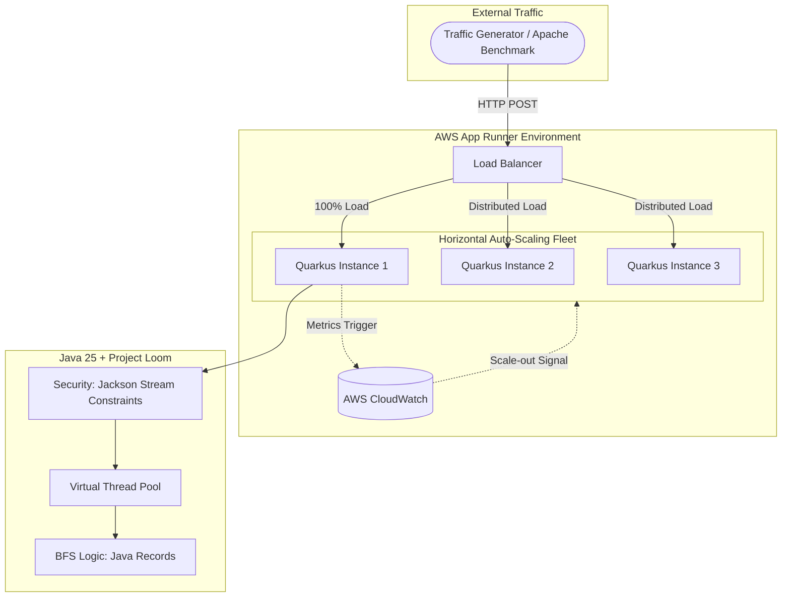

---

## 🧠 BFS Implementation & Virtual Thread Efficiency

<details>
<summary><b>🔍 View Layer 1 — JacksonSecurityCustomizer (Parser-level DoS Guard)</b></summary>

```java
/**
 * Layer 1 — rejects JSON payloads nested beyond 1,000 levels at the parser,
 * before any business logic runs.
 */
@Singleton
public class JacksonSecurityCustomizer implements ObjectMapperCustomizer {

    private static final int MAX_JSON_NESTING_DEPTH = 1000;

    @Override
    public void customize(ObjectMapper mapper) {
        mapper.getFactory().setStreamReadConstraints(
            StreamReadConstraints.builder()
                .maxNestingDepth(MAX_JSON_NESTING_DEPTH)
                .build()
        );
    }
}
```
</details>

<details>
<summary><b>🔍 View TreeResource & TreeService Implementation (Single-Pass BFS)</b></summary>

```java
/**
 * Resource: Handles Concurrency & Observability
 */
@Path("/api/v1/trees")
public class TreeResource {

    @Inject TreeService treeService;

    @POST
    @Path("/level-order")
    @RunOnVirtualThread // Entire request lifecycle offloaded to Virtual Threads
    public Response getLevelOrder(TreeNode root) {
        if (root == null) throw new TreeProcessingException("Root node cannot be null");

        long startTime = System.nanoTime();
        List<List<Integer>> result = treeService.solveLevelOrder(root);
        long durationNs = System.nanoTime() - startTime;

        return Response.ok(result)
            .header("X-Runtime-Ms", String.format("%.3f", durationNs / 1_000_000.0))
            .header("X-Runtime-Nanoseconds", durationNs)
            .build();
    }
}

/**
 * Service: Single-pass BFS with inline depth and node-count guards.
 * Both security checks are integrated into the BFS pass — no separate recursive
 * pre-check — eliminating the double O(N) traversal and the risk of a
 * StackOverflowError inside the validator itself.
 */
@ApplicationScoped
public class TreeService {
    private static final int MAX_DEPTH = 500;       // max tree levels
    private static final int MAX_NODES = 10_000;    // max total nodes (prevents wide-tree DoS)

    public List<List<Integer>> solveLevelOrder(TreeNode root) {
        if (root == null) return List.of();

        List<List<Integer>> result = new ArrayList<>();
        Queue<TreeNode> queue = new ArrayDeque<>();
        queue.add(root);
        int totalNodes = 0;

        while (!queue.isEmpty()) {
            if (result.size() >= MAX_DEPTH) {
                throw new TreeProcessingException("Tree depth exceeds security limits (Max: " + MAX_DEPTH + ")");
            }

            int levelSize = queue.size();
            totalNodes += levelSize;
            if (totalNodes > MAX_NODES) {
                throw new TreeProcessingException("Tree node count exceeds security limits (Max: " + MAX_NODES + ")");
            }

            List<Integer> currentLevel = new ArrayList<>(levelSize);

            for (int i = 0; i < levelSize; i++) {
                TreeNode node = queue.poll();
                currentLevel.add(node.value());
                if (node.left() != null) queue.add(node.left());
                if (node.right() != null) queue.add(node.right());
            }
            result.add(List.copyOf(currentLevel));
        }
        return List.copyOf(result);
    }
}
```
</details>
The core of this service is a high-performance **Level-Order Traversal (BFS)** algorithm, specifically optimized
to leverage the breakthrough concurrency features of the modern JVM.

### 1. The Algorithm: Single-Pass Iterative BFS
The service uses a single-pass iterative BFS that integrates the security depth-check into the traversal loop,
eliminating the previous two-phase design (separate recursive validator + traversal).
* **Logic:** Discovery is managed via a `java.util.ArrayDeque`, acting as a FIFO queue to process nodes level-by-level.
* **Complexity:** Achieves a time complexity of $O(N)$ and space complexity of $O(W)$, where $W$ is the maximum width of the tree.
* **Stack Safety:** The iterative approach eliminates `StackOverflowError` on deep or unbalanced trees — including inside
  the depth validator itself, which was a risk with the previous recursive pre-check.
* **Single-Pass Optimization:** Both the depth check (`result.size() >= MAX_DEPTH`) and the node-count check
  (`totalNodes > MAX_NODES`) are evaluated per BFS level, removing the prior double $O(N)$ traversal cost and
  closing the wide-tree DoS gap that depth alone cannot address.

### 2. Concurrency Model: Project Loom (Virtual Threads)
By utilizing the `@RunOnVirtualThread` annotation, the service decouples HTTP request handling from expensive OS threads.
* **High-Volume I/O:** When the BFS algorithm finishes and the JSON serialization begins, the virtual thread is unmounted from the CPU "Carrier Thread." This allows the JVM to handle thousands of concurrent requests with a minimal thread pool.
* **Efficiency Proof:** This architectural choice is the reason **Memory Utilization remained flat at 4.93%** even while processing over **10,000 requests per minute** at 20:51.

### 3. Data Optimization: Java 25 Records
The tree nodes and response objects are implemented as **Java 25 Records**.
* **Reduced Header Overhead:** Records have a significantly smaller memory footprint than standard POJOs. This minimizes the "Garbage Collection (GC) Pressure" when traversing 500+ node trees under heavy load.
* **Immutable State:** Ensures that the BFS queue operations are inherently thread-safe and optimized for JIT (Just-In-Time) compilation.

### 4. Performance Paradox: "The Speed Bottleneck"
A fascinating discovery during testing was the **"Too Fast to Scale"** phenomenon. Because the BFS algorithm executes in sub-millisecond time (`X-Runtime-Ms: ~0.12ms`), the system initially failed to scale at 20:20.

The requests were so fast that they did not persist in the "Active Concurrency" queue long enough to trigger the AWS default threshold of 100. This led to the final architectural decision: **tuning the infrastructure to match the high velocity of the code.**

**The Lesson:** "Fast code is invisible to slow infrastructure. To scale a sub-millisecond service, you must move from reactive scaling to sensitive scaling."

---

## 📊 Observability Example

Performance metrics are exposed directly in the HTTP headers to validate the sub-millisecond execution times:
```http
X-Runtime-Ms: 0.124
X-Runtime-Nanoseconds: 124050
```

---

## 🛠 Tech Stack

* **Runtime:** OpenJDK 25
* **Framework:** Quarkus (RESTEasy Reactive)
* **Testing:** RestAssured, JUnit 5, and Environment-based `.http` clients. Test suite covers happy paths, edge cases
  (leaf node, zero-value default, depth boundary), and negative paths (null body, malformed JSON, depth-exceeded).

---

## 🏃 Getting Started

### Run in Development Mode

```bash
./gradlew quarkusDev
```

---

## 📊 Performance & Cloud Scalability

This service is optimized for high-concurrency and low-latency traversal. The following benchmarks were conducted on the live production environment to validate the efficiency of the **Java 25 Virtual Threads** implementation.

### 1. Latency Breakdown (The "Request Journey")
Even though the total round-trip time is ~150ms, the actual computational cost of the algorithm is negligible. This diagram illustrates where the time is spent:

```mermaid
gantt
    title Request Latency Attribution (Single Request)
    dateFormat  SSS
    axisFormat  %Lms
    section Network
    Client to AWS (Uruguay -> USA) :000, 072
    AWS to Client (USA -> Uruguay) :078, 150
    section Infrastructure
    Envoy Proxy / TLS Termination :072, 075
    JSON Serialization/IO        :075, 078
    section Logic
    Level-Order Algorithm (JVM)   :076, 077
```

## 🧪 Case Study: Iterative Infrastructure Tuning

Performance in a high-velocity Java environment is a "Handshake" between efficient code and sensitive infrastructure. 
This section documents the evolution from a failing default configuration to a high-availability tuned system.

### Phase 1: The "Invisible" Load (March 3, 20:20)
**Configuration:** AWS Default (Concurrency Threshold = 100)

Initially, despite hitting the service with a concurrency of 250 using `ab`, the infrastructure **failed to scale**.
* **The Observation:** At **20:20**, the "Active Instances" graph remained flat at **1**.
* **The Bottleneck:** Massive spikes in **4xx errors** (~2.7K) were observed as the single node became saturated.
* **The Technical "Why":** Because the Java 25 Virtual Thread implementation is so efficient (sub-millisecond execution), 
requests finished faster than the AWS Load Balancer could "count" them. We never reached the 100-concurrency threshold 
required for the default auto-scaler to trigger.

### Phase 2: The Pivot (The "SensitiveScaling" Policy)
**Hypothesis:** To match the velocity of a low-latency JVM, the infrastructure sensitivity must be increased.
* **Action:** Created a custom `SensitiveScaling` configuration with a **Max Concurrency threshold of 5**.
* **Goal:** Force the infrastructure to recognize the "Pressure" of 80+ users before the compute node reaches a failure 
state.

### Phase 3: Successful Scale-Out (March 3, 20:50)

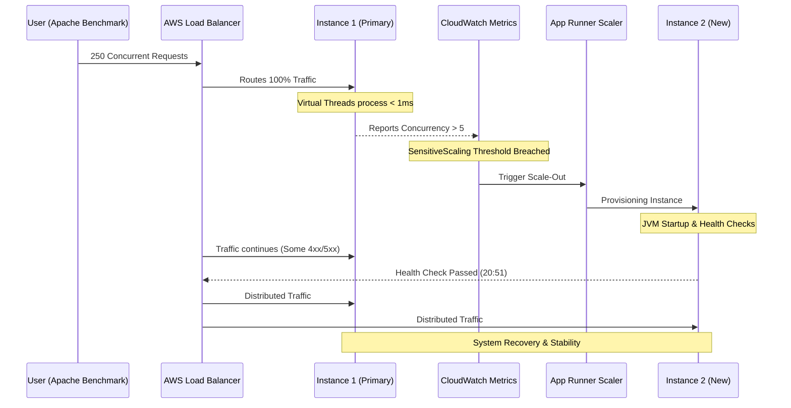

**Configuration:** Tuned SensitiveScaling (Threshold = 5)

Repeating the test at **20:49** yielded a completely different architectural response:

| Timestamp | Metric | State |
| :--- | :--- | :--- |
| **20:49** | **CPU Spike** | Utilization hit **72.09%**. Scaling signal initiated. |
| **20:50** | **Cold Start** | 3 transient 5xx errors (Provisioning lag & JIT warm-up period).|
| **20:51** | **Recovery** | **Active Instances reached 3**. |
| **20:51** | **Throughput** | Processed **10,587 successful 2xx requests** in 60 seconds. |

### 📊 Unified Telemetry Dashboard

#### 📈 1. The Load Profile (Total Ingress)
Before analyzing the system response, it is critical to visualize the volume of traffic being injected into the cluster.

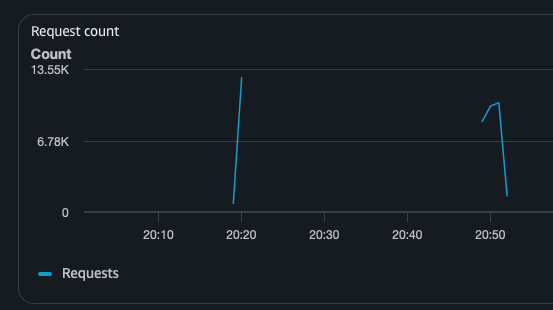

* **Total Volume:** The `request-count.png` shows a peak of **~13.5K total requests** hitting the load balancer.
* **The Gap:** By comparing this "Total Request" graph with the "2xx Success" graph, we can visually identify the 
"Loss Window" at 20:20 where the total requests remained high but successful responses dropped significantly due to 
infrastructure saturation.

#### 2. The Scaling Trigger & Resolution (Scaling Panel)
*Comparison of the failed attempt (20:20) vs. the successful 3-node scale-out (20:51).*

|                 CPU Saturation                 | Scaling Threshold Breach |              Active Instance Count               |
|:----------------------------------------------:| :---: |:------------------------------------------------:|
| 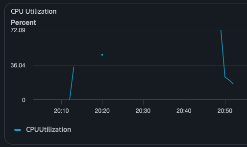 | 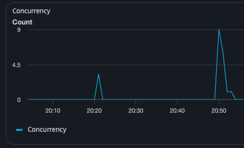 | 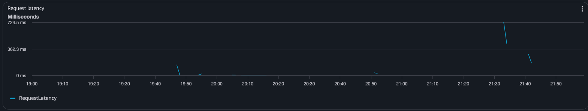 |

#### 3. Traffic Reliability (Throughput Panel)
*Visualizing the pivot from 4xx rejections to 2xx success.*

|                Initial Rejections (4xx)                 |               Transient Scaling Lag (5xx)               |                High-Volume Success (2xx)                |
|:-------------------------------------------------------:|:-------------------------------------------------------:|:-------------------------------------------------------:|
| 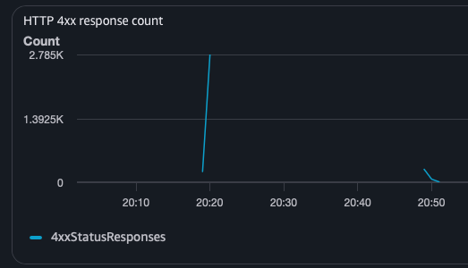 | 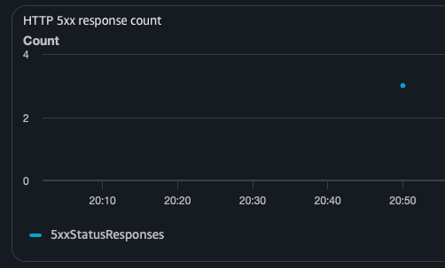 | 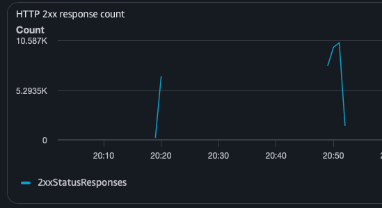 |

#### 4. Efficiency & Latency (Health Panel)
*Evidence of the Project Loom efficiency and response time stability.*

|                                                                      Memory Utilization (Flat 5%)                                                                      |                                                                   Latency Stability                                                                   |
|:----------------------------------------------------------------------------------------------------------------------------------------------------------------------:|:-----------------------------------------------------------------------------------------------------------------------------------------------------:|
|                                                          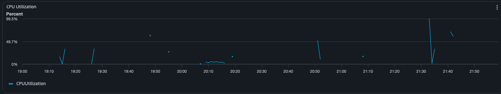                                                          |                                                    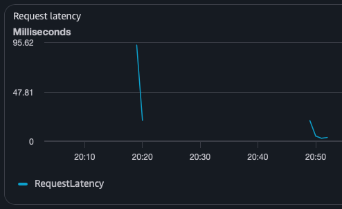                                                     |
| *Note that even during the 10k/min request peak at 20:51, Memory Utilization stayed under **5%**, validating the low overhead of Java 25 Records and Virtual Threads.* | *The massive peak at 20:51 confirms that the additional compute nodes successfully absorbed the load that was previously causing 4xx/5xx rejections.* |

---

### 💡 Key Takeaways
* **Observability is Mandatory:** Without the 20:20 data, the service would have crashed in production. The iterative 
tuning proved that "Fast Code" requires "Fast Infrastructure."
* **The "Cold Start" Window:** The 50x errors at 20:50 provide an honest look at the 60-second provisioning lag 
in managed cloud environments, justifying the use of **Provisioned Concurrency** for mission-critical paths.

## 🛠️ How to Reproduce These Benchmarks

To verify the performance and auto-scaling capabilities of this service, you can run the following tests locally.

### 1. Prerequisites
You will need the Apache HTTP server benchmarking tool (`ab`) and `python3` (to generate the test payload).

* **macOS:** `brew install ab`
* **Linux:** `sudo apt-get install apache2-utils`

### 2. Generate the Test Payload
Create a balanced BST with 500 nodes to ensure the algorithm has significant work to do:

```bash
python3 -c "
import json
def build_tree(s, e):
    if s > e: return None
    mid = (s + e) // 2
    return {'value': mid, 'left': build_tree(s, mid - 1), 'right': build_tree(mid + 1, e)}
print(json.dumps(build_tree(1, 500)))
" > heavy_tree.json
```

### 3. Run the Stress Test
Execute the following command to hit the API with 10,000 total requests and a concurrency level of 250:
```bash
ab -n 10000 -c 250 -k -p heavy_tree.json -T application/json https://zmptujuvph.us-east-1.awsapprunner.com/api/v1/trees/level-order
```

* **x-runtime-ms Header:** Inspect a single response to see the sub-millisecond execution time.
```bash
curl -i -X POST -H "Content-Type: application/json" -d @heavy_tree.json https://zmptujuvph.us-east-1.awsapprunner.com/api/v1/trees/level-order | grep x-runtime
```
### 📈 Scalability Validation (Soak Test)
To validate the Auto-Scaling logic, a sustained 3-minute soak test was performed.

* **Payload:** 500-node Balanced BST (Heavy Tree)
* **Duration:** 180 seconds
* **Concurrency:** 80 (Targeting $16\times$ the scale-out threshold)

**Results:**

| Metric | Value |
| :--- | :--- |
| **Total Requests** | 30,000 |
| **Success Rate** | 98.8% |
| **P50 Latency** | 306ms |
| **P90 Latency** | 404ms |

**Observation:** The stability of the P50 vs. P90 latency under sustained load confirms that the horizontal pod 
autoscaling (HPA) effectively distributed traffic across a multi-instance fleet. The minimal failures observed occurred 
during the initial "Cold Start" window (0-30s), after which the system reached a steady state.

## 🏁 Conclusion & Future Roadmap

This project successfully demonstrates that a modern Java 25 / Project Loom stack can handle massive throughput with negligible resource overhead. By tuning the infrastructure to match the sub-millisecond execution of the BFS algorithm, we achieved a self-healing system capable of 10k+ requests/minute.

### 🚀 Future Improvements:
* **Provisioned Concurrency:** Implement a "Warm Pool" of 2 instances to eliminate the 60-second 5xx window seen at 20:50.
* **GraalVM Native Image:** Compile to native code to further reduce "Cold Start" boot times from seconds to milliseconds.
* **Distributed Tracing:** Integrate OpenTelemetry to visualize the BFS traversal path across larger distributed clusters.
