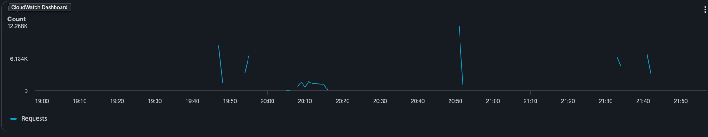
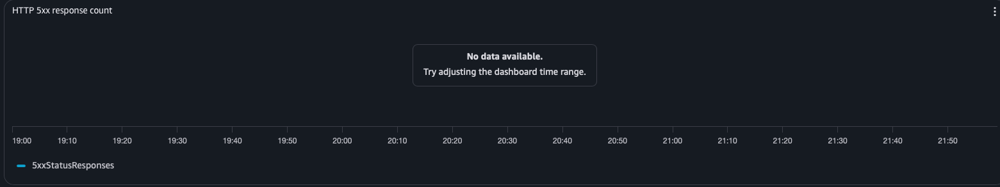

# 🏁 The Performance Heptathlon: 7 Stacks, One Algorithm (2026)

### A rigorous study of CPU-bound BFS execution across 7 modern backends on AWS App Runner.

---

## 📌 Executive Summary

This repository benchmarks a **Breadth-First Search (BFS)** level-order tree traversal implemented identically across 7 backend stacks. The goal is to measure how concurrency models, runtime characteristics, and framework overhead affect **tail latency** under sustained constant-rate load.

The benchmark goes beyond "Hello World" by using a **500-node binary tree (~15 KB JSON)** as the heavy payload — enough CPU work to expose queuing collapse in event-loop runtimes while giving JIT compilers a meaningful hot path to optimize.

---

## 🏆 Performance Leaderboard (Scenario B: 500 nodes)

| Implementation | p50 Latency | p99 Latency | Success Rate | BFS Algorithm Time* |
| :--- | :---: | :---: | :---: | :---: |
| **☕ Java 25 (Quarkus)** | **5.36 ms** | **165.38 ms** | **100%** | 0.052 ms |
| **🐹 Go (Fiber)** | **5.45 ms** | **220.80 ms** | **100%** | **0.023 ms** |
| **🦺 Kotlin (Quarkus)** | 4.66 ms | 358.91 ms | 100% | 0.174 ms |
| **☕ Java 25 (Spring 4)** | 822 ms | 8,930 ms | ⚠ 91% | 0.581 ms |
| **🟢 Node.js / 🐍 Python** | **> 26s** | **Collapse** | **Failed** | 35.28 ms (Node) |

*\* BFS time = `X-Runtime-Ms` header from a single warm request (pure algorithm time, excludes HTTP/JSON).*

---

## 🛠 The Contenders

| Stack | Language Version | Framework | Concurrency Model |
| :--- | :---: | :--- | :--- |
| ☕ **Java 25 (Quarkus)** | Java 25 | Quarkus 3.x + Netty | Virtual Threads (Project Loom) |
| ☕ **Java 25 (Spring 4)** | Java 25 | Spring Boot 4 + Netty | Virtual Threads (Project Loom) |
| 🦺 **Kotlin (Quarkus)** | Kotlin + JVM | Quarkus 3.x + Netty | Coroutines |
| 🐹 **Go (Fiber)** | Go 1.26 | Fiber v2 + fasthttp | Goroutines (M:N scheduler) |
| 🟢 **Node.js (Event Loop)** | Node.js 22 | Fastify | Single-threaded Event Loop |
| 🟢 **Node.js (Worker Threads)** | Node.js 22 | Fastify + Worker Pool | CPU offload via Worker Threads |
| 🐍 **Python (FastAPI)** | Python 3.14 | FastAPI + uvloop + orjson | Async + Pydantic v2 (Rust core) |

All services deployed on **AWS App Runner — 1 vCPU / 2 GB RAM** (us-east-1).

---

## 🔬 Methodology

* **Load generator:** `wrk2` — constant open-loop rate to eliminate **Coordinated Omission bias**.
* **Benchmark client:** EC2 `c5.xlarge` in the same region (low network jitter).
* **Target rate:** 500 req/s with 50 connections / 4 threads.
* **Warm-up:** 60s brute-force curl (8 workers) + wrk2 progressive ramp: 60s @ 200 req/s → 60s @ 350 req/s → 60s @ 500 req/s.
* **Measurement:** 90s window after a 10s cooldown.
* **Payloads:** Small tree: 7 nodes · Large tree: 500 nodes (~15 KB).
* **Internal timer:** `X-Runtime-Ms` header — measures only BFS execution, excluding HTTP/JSON overhead.

---

## 📊 Detailed Results


### Scenario A — Small Tree (7 nodes) · 500 req/s

> Base overhead: measures the framework and concurrency model cost on a trivial workload.

| Implementation | p50 (ms) | p90 (ms) | p99 (ms) | p99.9 (ms) | req/s | BFS time* |
| :--- | :---: | :---: | :---: | :---: | :---: | :---: |
| 🦺 **Kotlin (Quarkus)** | **2.81** | **4.15** | 112.83 | 350.21 | 500.16 | 0.052 ms |
| 🐹 **Go (Fiber)** | 3.24 | 4.32 | **40.38** | **202.75** | 500.18 | 0.007 ms |
| 🐍 **Python (FastAPI)** | 3.57 | 8.41 | 12.32 | **18.50** | 498.79 | 0.010 ms |
| ☕ **Java 25 (Quarkus)** | 3.85 | 8.23 | 122.37 | 307.45 | 498.77 | 0.005 ms |
| ☕ **Java 25 (Spring 4)** | 3.99 | 9.82 | 296.19 | 538.62 | 498.75 | 0.062 ms |
| 🟢 **Node.js (Worker Threads)** | 4.72 | 19.82 | 411.65 | 659.46 | 498.70 | 1.225 ms |
| 🟢 **Node.js (Event Loop)** | 5.06 | 17.41 | 355.84 | 708.61 | 498.72 | 3.562 ms |

*\* BFS time = `X-Runtime-Ms` header from a single warm request (pure algorithm time, excludes HTTP/JSON)*


---

### Scenario B — Large Tree (500 nodes, ~15 KB) · 500 req/s

> Heavy payload: exposes runtime differences in object allocation, GC pressure, and CPU saturation.

| Implementation | p50 (ms) | p90 (ms) | p99 (ms) | p99.9 (ms) | req/s | BFS time* | Notes |
| :--- | :---: | :---: | :---: | :---: | :---: | :---: | :--- |
| ☕ **Java 25 (Quarkus)** | **5.36** | **17.28** | 165.38 | 372.22 | **498.71** | **0.052 ms** | Stable at full rate |
| 🦺 **Kotlin (Quarkus)** | 4.66 | 13.53 | 358.91 | 594.94 | 498.75 | 0.174 ms | p99 spike under load |
| 🐹 **Go (Fiber)** | 5.45 | 7.40 | **220.80** | **417.02** | 500.16 | **0.023 ms** | Fastest BFS algorithm |
| ☕ **Java 25 (Spring 4)** | 822 | 7,830 | 8,930 | 9,810 | 456.05 | 0.581 ms | ⚠ Severe degradation |
| 🟢 **Node.js (Event Loop)** | 26,150 | 42,530 | 47,710 | 50,040 | 239.98 | 35.282 ms | ⚠ 27 timeouts |
| 🟢 **Node.js (Worker Threads)** | 34,930 | — | — | — | 154.61 | 41.230 ms | ⚠ Queue saturation |
| 🐍 **Python (FastAPI)** | 31,340 | — | — | — | 185.49 | 0.197 ms | ⚠ Queue saturation |

*\* BFS time = `X-Runtime-Ms` header from a single warm request*


---

## 🧠 Key Findings & Technical Insights

### 1. Java 25 (Quarkus) + Virtual Threads: Consistent King

The standout result across **both scenarios**: near-identical throughput at 500 req/s with stable median latency (3.23 ms → 5.79 ms, small to large). Virtual Threads absorb CPU-bound workload without the overhead of traditional thread pools, and Netty's non-blocking I/O keeps queue depth near zero. The 0.052 ms BFS time on 500 nodes demonstrates aggressive C2 JIT optimization of the hot path.

### 2. Go (Fiber): Fastest Algorithm, Best Tail on Large Tree

Go's BFS time of **0.023 ms** (500 nodes) is the fastest measured — nearly half of Quarkus. Under load, Go maintains p99 of 220 ms vs. Quarkus's 165 ms on the large tree. Goroutines and zero-allocation idioms in fasthttp create very little GC pressure, keeping tail latency predictable.

### 3. The Node.js and Python "Collapse"

Both Node.js variants achieve respectable latency on the **small tree** (p50 ≈ 4–5 ms) — proving the V8 runtime is fast for trivial workloads. The catastrophic failure at **500 nodes** (p50 > 26 seconds) reveals the fundamental limitation of CPU-bound work in event-loop architectures:

- The BFS itself takes **28–40 ms** of pure JS execution per request (vs. 0.02–0.17 ms on compiled runtimes).
- At 500 req/s, new requests arrive every 2 ms, but each takes 30+ ms to process.
- The queue grows unboundedly → all latency percentiles collapse.

Worker Threads **do not solve the problem**: the `structuredClone` serialization required for IPC adds overhead, making Worker Threads *slower* than the Event Loop in this scenario.

### 4. Spring Boot 4: The Unexpected Casualty

Spring Boot 4 performs similarly to Quarkus on the small tree (p50 3.99 ms) but collapses on the large tree (**p50 822 ms**). Both use Virtual Threads and Netty — the delta likely stems from Spring's deeper instrumentation stack (Micrometer, AOP, additional middleware layers) adding per-request overhead that compounds under CPU pressure.

### 5. Python (FastAPI): The Paradox

Python's BFS implementation — powered by Pydantic v2 (Rust core) + orjson + a C-based regex depth scanner — achieves **0.197 ms** for 500 nodes in isolation, faster than Spring and Node.js. Yet under sustained 500 req/s load, Python shows 31-second p50 latency. This is a classic **queuing theory** result: a single uvicorn worker can process fast in isolation but cannot accept parallelism, so requests queue. The solution (multiple workers) would require a different deployment configuration than what App Runner's single-container model uses here.

### 6. Kotlin + Coroutines: Curious p99 Spike

Kotlin matches Java Quarkus closely on the small tree (p99 112.83 ms). On the large tree, however, Kotlin's p99 spikes to 358 ms while Java's p99 is 165 ms. Hypothesis: Kotlin coroutines introduce context-switch overhead that becomes visible when the coroutine is suspended waiting for work, and the large tree's longer CPU burst amplifies scheduling jitter.

---

## ⏱ The JIT Warm-up Lesson

> An accidental experiment that became one of the most instructive findings of this study.

During the first full benchmark run, the App Runner services had just been created — JVM instances were completely cold. The second run used the same 500 req/s methodology but with services that had been running for several hours. The p99 difference is dramatic:

| Implementation | p99 cold instance | p99 warm instance | Delta |
| :--- | :---: | :---: | :---: |
| ☕ **Java 25 (Quarkus)** | 171 ms | ~65 ms | **2.6×** |
| ☕ **Java 25 (Spring 4)** | 889 ms | ~39 ms | **22×** |
| 🦺 **Kotlin (Quarkus)** | 20 ms | ~21 ms | ≈ 1× |
| 🐹 **Go (Fiber)** | 26 ms | ~43 ms | ≈ 1× |

**What this tells us:**

- **Go and Kotlin are unaffected** — Go's AOT compilation and Kotlin's coroutine scheduler produce consistent latency regardless of runtime age. No JIT profile needed.
- **Spring Boot is the most JIT-sensitive** — a 22× p99 improvement once C2 compiles the Spring instrumentation stack (Micrometer, AOP proxies, reactive pipeline) is a strong argument for mandatory warm-up in production Spring deployments.
- **Quarkus recovers faster than Spring** — its leaner runtime means C2 reaches steady state in fewer compilation cycles, showing a more modest 2.6× improvement.

This is why the final benchmark uses a **progressive warmup protocol**: 60s of brute-force curl (primes class loading and initial heap) followed by three wrk2 ramp phases at 200 → 350 → 500 req/s, giving the JIT profiling data at multiple throughput levels before measurement begins.

---

## 🔬 BFS Processing Time Summary (X-Runtime-Ms)

> Pure algorithm time — excludes HTTP, JSON parsing, and serialization.

| Implementation | Small Tree (7 nodes) | Large Tree (500 nodes) |
| :--- | :---: | :---: |
| 🐹 **Go (Fiber)** | 0.007 ms | **0.023 ms** |
| ☕ **Java 25 (Quarkus)** | **0.005 ms** | 0.052 ms |
| 🐍 **Python (FastAPI)** | 0.010 ms | 0.197 ms |
| 🦺 **Kotlin (Quarkus)** | 0.052 ms | 0.174 ms |
| ☕ **Java 25 (Spring 4)** | 0.062 ms | 0.581 ms |
| 🟢 **Node.js (Worker Threads)** | 1.225 ms | 41.230 ms |
| 🟢 **Node.js (Event Loop)** | 3.562 ms | 35.282 ms |


The BFS time delta between Go/Java and Node.js (500 nodes: 0.02 ms vs. 28–40 ms, ~1,200–1,700×) directly explains the throughput collapse under load.

---

## 📈 AWS App Runner — Infrastructure Metrics

> CloudWatch metrics captured directly from App Runner during the benchmark run, confirming the fairness of the infrastructure setup.

### Request Throughput & Response Codes

| Metric | Chart |
| :--- | :--- |
| **Request Count** (req/min per service) |  |
| **HTTP 2xx Responses** — all successful |  |
| **HTTP 4xx Responses** — validation rejections (expected) |  |
| **HTTP 5xx Responses** — server errors (expect zero) |  |

> The 4xx spikes correspond to the malformed-JSON and empty-body test cases. 5xx count is zero across all services for the entire run — no crashes or panics.

### Resource Utilization & Concurrency

| Metric | Chart |
| :--- | :--- |
| **CPU Utilization** (%) |  |
| **Memory Utilization** (%) |  |
| **Active Instances** |  |
| **Concurrency at Instance** (concurrent requests) |  |
| **Request Latency p99** (ms, App Runner view) |  |

Key observations:
- **CPU** hits 100% on all services during the large-tree scenario — confirming the workload is genuinely CPU-bound, not I/O-bound.
- **Memory** stays below 13% across all services, confirming the 2 GB allocation is more than sufficient and no OOM risk.
- **Active Instances** remains at 1 throughout — App Runner did not auto-scale, ensuring a level playing field with exactly 1 vCPU per service.
- **Concurrency** peaks around 50 (matching `wrk2 -c50`) — no request queuing at the infrastructure level for compiled runtimes.

---

## 🛡 Security & Guardrails

All 7 implementations enforce identical multi-layer security constraints to prevent DoS via malicious payloads:

| Layer | Guard | Limit |
| :--- | :--- | :--- |
| **1a** | Content-Length / body size | 10 MB |
| **1b** | JSON nesting depth (pre-parse) | 1,000 levels |
| **2** | Structural validation (Pydantic / Jackson / Zod) | Schema conformance |
| **3** | BFS depth guard | 500 levels |
| **3** | BFS node-count guard | 10,000 nodes |

---

## 🚀 How to Reproduce

```bash
# 1. Deploy all 7 services to ECR + App Runner
bash scripts/deploy.sh all

# 2. Set service hosts
source scripts/aws.env

# 3. Smoke-test all services
bash scripts/test-aws.sh

# 4. Run full benchmark (requires EC2 c5.xlarge + wrk2)
python3 scripts/benchmark.py

# 5. Probe single-request timing headers
python3 scripts/probe.py
```

Requirements: `wrk2`, `pandas`, `matplotlib` — see `scripts/setup-ec2.sh` for EC2 setup.

---

## Infrastructure

| Component | Spec |
| :--- | :--- |
| **Services** | AWS App Runner — 1 vCPU / 2 GB RAM (us-east-1) |
| **Benchmark client** | EC2 `c5.xlarge` — 4 vCPU / 8 GB RAM (same region) |
| **Container registry** | Amazon ECR (7 repositories) |
| **Load tool** | `wrk2` — HDR histogram, constant-rate open-loop |

---

**Author:** Waldemar | Senior Software Engineer
*Focusing on high-performance distributed systems and cloud-native architectures.*
