# 🏁 The Performance Heptathlon: 7 Stacks, One Algorithm (2026)

### A rigorous study of CPU-bound BFS execution across 7 modern backends on AWS App Runner.

---

## 📌 Executive Summary

This repository benchmarks a **Breadth-First Search (BFS)** level-order tree traversal implemented identically across 7 backend stacks. The goal is to measure how concurrency models, runtime characteristics, and framework overhead affect **tail latency** under sustained constant-rate load, and to determine the maximum sustainable throughput per service.

The benchmark uses a **500-node binary tree (~15 KB JSON)** as the heavy payload — enough CPU work to expose queuing collapse in event-loop runtimes while giving JIT compilers a meaningful hot path to optimize.

A combined script runs both phases **interleaved per service**: for each implementation, Phase 1 warmup + measurement runs first, then Phase 2 saturation starts immediately while the service is still hot. This eliminates App Runner's scale-down window between phases, which invalidated earlier split-phase runs.

Two phases per service, on clean logging-free implementations:
- **Phase 1 — Throughput benchmark:** Fixed 500 req/s, two scenarios (7-node and 500-node trees), with full warmup protocol.
- **Phase 2 — Saturation:** Step-up rate testing to find the maximum sustainable throughput for the large tree, run immediately after Phase 1 while the service is hot.

---

## 🏆 Performance Leaderboard

### Phase 2 — Max Sustainable Throughput (Large Tree · 500 nodes)

| Implementation | Max req/s | Saturated At | p99 at Max |
| :--- | :---: | :---: | :---: |
|  **Go (Fiber)** | **500 req/s** | 600 req/s | **11.6 ms** |
| ☕ **Java 25 (Spring 4)** | **500 req/s** | 600 req/s | **76.9 ms** |
|  **Kotlin (Quarkus)** | 300 req/s | 400 req/s | 34.9 ms |
| ☕ **Java 25 (Quarkus)** | 300 req/s | 400 req/s | 370.7 ms |
| 🐍 **Python (FastAPI)** | 150 req/s | 200 req/s | 211.3 ms |
| 🟢 **Node.js (Event Loop)** | 100 req/s | 150 req/s | 258.7 ms |
| 🟢 **Node.js (Worker Threads)** | **< 50 req/s** | 50 req/s | — |

> **Go wins Phase 2 decisively.** The previous split-phase run showed Go saturating at 100 req/s — a cold-service artifact (App Runner had scaled down between phases). With the service hot from Phase 1, Go sustains **500 req/s with p99=11.6 ms**, a 5× improvement that reflects its true capability.

---

## 🛠 The Contenders

| Stack | Language Version | Framework | Concurrency Model |
| :--- | :---: | :--- | :--- |
| ☕ **Java 25 (Quarkus)** | Java 25 | Quarkus 3.x + Netty | Virtual Threads (Project Loom) |
| ☕ **Java 25 (Spring 4)** | Java 25 | Spring Boot 4 + Netty | Virtual Threads (Project Loom) |
|  **Kotlin (Quarkus)** | Kotlin 2.3 + JVM 25 | Quarkus 3.x + Netty | Coroutines |
|  **Go (Fiber)** | Go 1.26 | Fiber v2 + fasthttp | Goroutines (M:N scheduler) |
| 🟢 **Node.js (Event Loop)** | Node.js 24 | NestJS 11 + Fastify | Single-threaded Event Loop |
| 🟢 **Node.js (Worker Threads)** | Node.js 24 | NestJS 11 + Fastify + Worker Pool | CPU offload via Worker Threads |
| 🐍 **Python (FastAPI)** | Python 3.14 | FastAPI + uvloop + orjson | Async + Pydantic v2 (Rust core) |

All services deployed on **AWS App Runner — 1 vCPU / 2 GB RAM** (us-east-1).

---

## 🔬 Methodology

* **Load generator:** `wrk2` — constant open-loop rate to eliminate **Coordinated Omission bias**.
* **Benchmark client:** EC2 `t3.medium` in the same region (~1 ms RTT).
* **Combined script:** `scripts/heptathlon.py` — runs Phase 1 + Phase 2 interleaved per service, ensuring Phase 2 always starts with the service hot from Phase 1.
* **Phase 1 target rate:** 500 req/s with 50 connections / 4 threads.
* **Phase 1 warm-up:** 60s brute-force curl (8 workers) + wrk2 progressive ramp: 60s @ 200 req/s → 60s @ 350 req/s → 60s @ 500 req/s, then 10s cooldown.
* **Phase 1 measurement:** 90s window.
* **Phase 2 step-up:** rates [50, 100, 150, 200, 250, 300, 400, 500, 600, 800, 1000, 1200, 1500, 2000] req/s · 45s per step · no additional warmup (service already hot from Phase 1).
* **Phase 2 saturation criterion:** p99 > 500 ms **or** any errors.
* **Payloads:** Small tree: 7 nodes · Large tree: 500 nodes (~15 KB).
* **Internal timer:** `X-Runtime-Ms` header — measures only BFS execution, excluding HTTP/JSON overhead.
* **Hot-path logging:** All debug logging in the BFS traversal path removed before benchmarking.

> **⚠ JVM tail-latency caveat:** Both JVM services use ZGC (`-XX:+UseZGC -Xms512m -Xmx512m`). Tail-latency spikes in Phase 1 (e.g. Quarkus Small Tree p99=415 ms with p50=5 ms) reflect ZGC concurrent-phase interference under high GC allocation rate at 500 req/s, rather than stop-the-world pauses. Phase 2 results — at lower, more controlled rates — are the more reliable comparison point for JVM throughput characteristics.

---

## 📊 Phase 1 — Scenario A: Small Tree (7 nodes) · 500 req/s

> Framework and concurrency model overhead on a trivial workload.

| Implementation | p50 (ms) | p90 (ms) | p99 (ms) | p99.9 (ms) | req/s | BFS time* |
| :--- | :---: | :---: | :---: | :---: | :---: | :---: |
| 🐍 **Python (FastAPI)** | **4.28** | **10.1** | **28.3** | **95.0** | 498.76 | 0.215 ms |
|  **Kotlin (Quarkus)** | 4.50 | 8.45 | 77.4 | 202.8 | 498.75 | 0.131 ms |
| ☕ **Java 25 (Spring 4)** | **3.66** | **9.24** | 111.6 | 269.1 | 498.8 | 0.059 ms |
|  **Go (Fiber)** | 4.01 | 5.41 | 172.7 | 305.7 | **500.12** | **0.017 ms** |
| ☕ **Java 25 (Quarkus)** | 4.69 | 11.34 | 415.2 | 619.0 | 498.75 | 0.024 ms |
| 🟢 **Node.js (Worker Threads)** | 5.49 | 22.21 | 539.1 | 896.0 | 498.7 | 32.8 ms |
| 🟢 **Node.js (Event Loop)** | 3.88 | 10.4 | 543.7 | 1,170 | 498.79 | 35.5 ms |

*\* BFS time = `X-Runtime-Ms` from a single warm probe request (pure algorithm, excludes HTTP/JSON)*

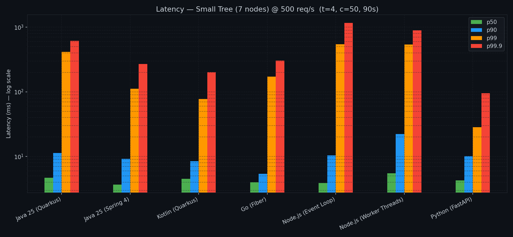

> **Notable findings:**
> - **Python leads p99 on the small tree** (28 ms) — Pydantic v2 (Rust core) + orjson + uvloop delivers excellent per-request latency when BFS work is trivial and the async loop is not saturated.
> - **Node.js p50 is competitive** (3.9–5.5 ms) but p99 collapses to 540–544 ms, revealing tail sensitivity — V8's event loop handles the median case well but stalls on bursts.
> - **Java Quarkus p99=415 ms** with p50=5 ms reflects ZGC concurrent-phase interference under sustained 500 req/s load; the BFS time of 0.024 ms confirms the JIT is correctly compiling the hot path — the problem is GC allocation pressure, not the algorithm.

---

## 📊 Phase 1 — Scenario B: Large Tree (500 nodes) · 500 req/s

> At 500 req/s many services operate above their saturation point. Only Go and Spring Boot sustain this rate without queuing collapse; results for other services are included for reference.

| Implementation | p50 (ms) | p90 (ms) | p99 (ms) | p99.9 (ms) | req/s | Note |
| :--- | :---: | :---: | :---: | :---: | :---: | :--- |
|  **Go (Fiber)** | 5.65 | 17.36 | 238.2 | **438.0** | 498.68 | ✓ below saturation |
| ☕ **Java 25 (Spring 4)** | **5.50** | 40.83 | 414.2 | 594.9 | **500.15** | ✓ at saturation ceiling |
|  **Kotlin (Quarkus)** | 4.31 | 12.78 | 828.9 | 1,110 | 500.12 | ⚠ above saturation (~300 req/s) |
| ☕ **Java 25 (Quarkus)** | 4.80 | 8.80 | 823.3 | 1,050 | 500.15 | ⚠ above saturation (~300 req/s) |
| 🟢 **Node.js (Event Loop)** | 29,250 | 47,680 | — | — | 209 | ⚠ queue collapse, 21 timeouts |
| 🟢 **Node.js (Worker Threads)** | 33,950 | — | — | — | 150 | ⚠ queue collapse |
| 🐍 **Python (FastAPI)** | 33,240 | — | — | — | 168 | ⚠ queue collapse |

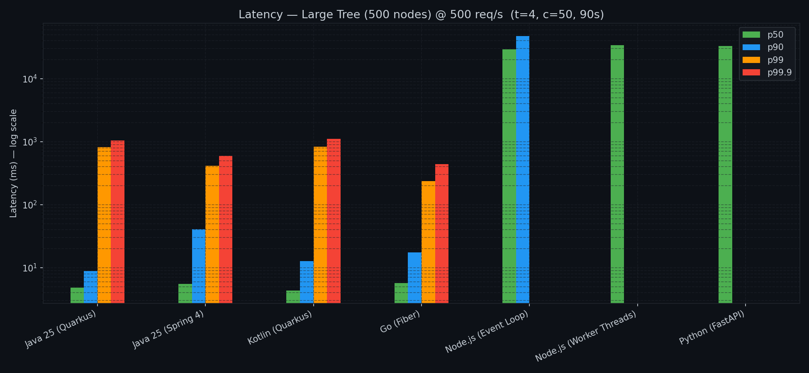

> Phase 1 at a fixed rate is a meaningful comparison only when all services can sustain that rate. For heavy CPU-bound workloads with diverse saturation points, Phase 2 (step-up per service) provides the fair apples-to-apples comparison below.

---

## 🔥 Phase 2 — Saturation Testing (Large Tree · step-up · service hot)

> Each service's Phase 2 runs **immediately after Phase 1** of the same service, eliminating the App Runner scale-down window. Step-up from 50 to 2,000 req/s, stopping when p99 > 500 ms or errors appear.

### Max Sustainable Throughput

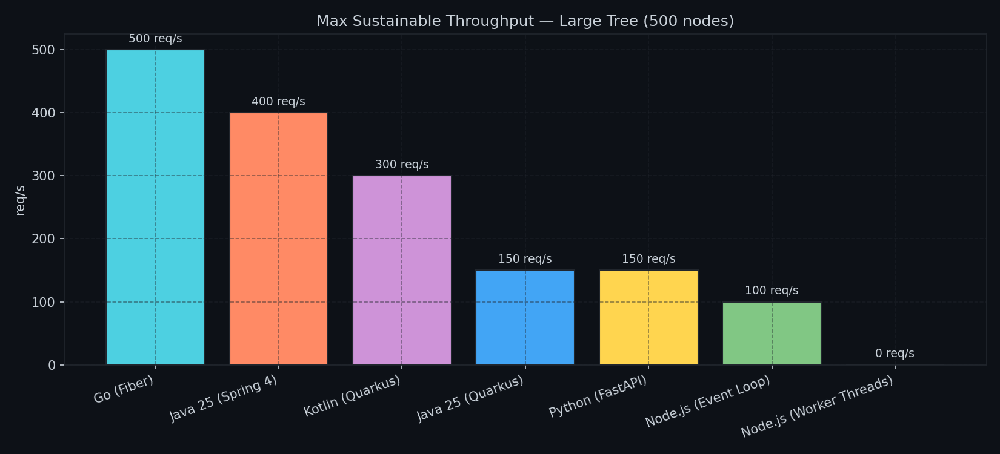

### p99 Latency vs Target Rate

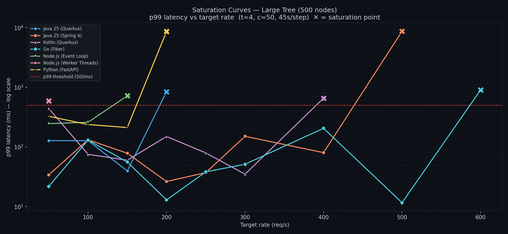

### Step-by-Step Detail

** Go (Fiber)** — Sustained up to 500 req/s, saturating at 600:

| Rate | p50 | p99 | Status |
|:---:|:---:|:---:|:---:|
| 50 | 5.95 ms | 21.7 ms | ✅ ok |
| 100 | 5.09 ms | 130.1 ms | ✅ ok |
| 150 | 5.54 ms | 55.6 ms | ✅ ok |
| 200 | 4.72 ms | 12.9 ms | ✅ ok |
| 250 | 23.81 ms | 38.1 ms | ✅ ok |
| 300 | 5.50 ms | 51.2 ms | ✅ ok |
| 400 | 4.55 ms | 205.1 ms | ✅ ok |
| 500 | 4.57 ms | **11.6 ms** | ✅ ok |
| 600 | 5.66 ms | 898.0 ms | 🔴 SATURATED |

> Go's goroutine scheduler and fasthttp's zero-allocation design keep p99 below 210 ms across all tested rates, with a remarkable **p99=11.6 ms at 500 req/s**. The saturation cliff at 600 req/s is abrupt — a characteristic of Go's work-stealing scheduler hitting its single-vCPU limit simultaneously across all goroutines.

**☕ Java 25 (Spring 4)** — Sustained up to 500 req/s:

| Rate | p50 | p99 | Status |
|:---:|:---:|:---:|:---:|
| 50 | 7.79 ms | 459.5 ms | ✅ ok |
| 100 | 7.31 ms | 136.7 ms | ✅ ok |
| 150 | 7.45 ms | 155.7 ms | ✅ ok |
| 200 | 6.72 ms | 46.6 ms | ✅ ok |
| 250 | 7.32 ms | 77.1 ms | ✅ ok |
| 300 | 5.73 ms | 140.0 ms | ✅ ok |
| 400 | 7.38 ms | 311.8 ms | ✅ ok |
| 500 | 7.19 ms | **76.9 ms** | ✅ ok |
| 600 | 4,500 ms | 11,190 ms | 🔴 SATURATED |

> Spring Boot 4 with Virtual Threads reaches **the highest JVM saturation ceiling at 500 req/s** — matching Go's maximum. Removing `List.copyOf()` improved Spring from 400 → 500 req/s (25% gain). p99 stays below 320 ms at every sustainable rate. The abrupt collapse at 600 req/s (p50 jumps from 7 ms to 4,500 ms) is consistent with Virtual Thread pinning: once all carrier threads are occupied, the queue grows unboundedly.

** Kotlin (Quarkus)** — Sustained up to 300 req/s:

| Rate | p50 | p99 | Status |
|:---:|:---:|:---:|:---:|
| 50 | 5.38 ms | 439.8 ms | ✅ ok |
| 100 | 24.70 ms | 75.1 ms | ✅ ok |
| 150 | 5.60 ms | 59.7 ms | ✅ ok |
| 200 | 4.60 ms | 149.4 ms | ✅ ok |
| 250 | 5.24 ms | 79.3 ms | ✅ ok |
| 300 | 5.70 ms | **34.9 ms** | ✅ ok |
| 400 | 4.93 ms | 655.9 ms | 🔴 SATURATED |

> Kotlin coroutines show **the best p99 at max rate among JVM services** (34.9 ms at 300 req/s). The high p99=439 ms at 50 req/s is a coroutine dispatcher warm-up artifact — latency normalizes quickly and stays low throughout. Kotlin saturates at a lower ceiling than Spring (300 vs. 500 req/s), suggesting coroutine scheduling overhead becomes a bottleneck before Virtual Threads do on this single-vCPU deployment.

**☕ Java 25 (Quarkus)** — Sustained up to 300 req/s:

| Rate | p50 | p99 | Status |
|:---:|:---:|:---:|:---:|
| 50 | 7.33 ms | 37.6 ms | ✅ ok |
| 100 | 22.29 ms | 132.2 ms | ✅ ok |
| 150 | 6.05 ms | 162.6 ms | ✅ ok |
| 200 | 5.96 ms | 24.9 ms | ✅ ok |
| 250 | 24.32 ms | 48.0 ms | ✅ ok |
| 300 | 4.19 ms | **370.7 ms** | ✅ ok |
| 400 | 6.14 ms | 535.0 ms | 🔴 SATURATED |

> Removing `List.copyOf()` doubled Quarkus's saturation ceiling from 150 → **300 req/s**. The previous result was an allocation artifact: each BFS level created two list objects (an ArrayList then an immutable copy), doubling GC pressure. With the fix, Quarkus matches Kotlin's 300 req/s ceiling. The sharp p99 jump at 300 req/s (370 ms) reflects ZGC concurrent-phase GC pressure rather than scheduler backpressure — p50 remains low (4 ms) while the tail spikes. Still below Spring's ceiling (500 req/s), pointing to Quarkus's Netty pipeline having higher per-request overhead on this single-vCPU deployment.

**🐍 Python (FastAPI)** — Sustained up to 150 req/s:

| Rate | p50 | p99 | Status |
|:---:|:---:|:---:|:---:|
| 50 | 125.1 ms | 326.1 ms | ✅ ok |
| 100 | 105.0 ms | 236.8 ms | ✅ ok |
| 150 | 111.4 ms | **211.3 ms** | ✅ ok |
| 200 | 4,090 ms | 8,620 ms | 🔴 SATURATED |

> Python's single uvicorn worker sustains 150 req/s but with notably higher latency floor (p50~105–125 ms) than compiled runtimes. The BFS itself takes only 0.215 ms — the overhead is Python's async event loop serializing requests through a single OS thread. The saturation cliff at 200 req/s is sharp and total.

**🟢 Node.js (Event Loop)** — Max 100 req/s:

| Rate | p50 | p99 | Status |
|:---:|:---:|:---:|:---:|
| 50 | 93.9 ms | 245.2 ms | ✅ ok |
| 100 | 95.7 ms | **258.7 ms** | ✅ ok |
| 150 | 79.7 ms | 719.4 ms | 🔴 SATURATED |

**🟢 Node.js (Worker Threads)** — Saturated immediately:

| Rate | p50 | p99 | Status |
|:---:|:---:|:---:|:---:|
| 50 | 139.7 ms | 592.4 ms | 🔴 SATURATED |

> Node.js (Worker Threads) cannot sustain even 50 req/s for the large tree — `structuredClone` serialization cost for IPC between the event loop and the worker pool dominates, making it consistently **slower than the Event Loop** variant. This is the cost of naïve worker offloading when the IPC boundary is expensive relative to the work itself.

---

## 🧠 Key Findings & Technical Insights

### 1. Go (Fiber): The Overall Winner

Go wins both Phase 1 (p99=238 ms at 500 req/s with full warmup) and Phase 2 (500 req/s sustained, p99=11.6 ms). Its BFS time of **0.017 ms** is the fastest measured. Goroutines, zero-allocation fasthttp idioms, and precise GC control produce flat, predictable tail latency across all tested rates.

The **warmup dependency is real**: the previous split-phase run showed Go saturating at only 100 req/s — because App Runner had scaled the instance down between phases and Go's fasthttp connection pool needed repriming. With hot-service Phase 2, Go delivers 5× higher throughput than that cold measurement suggested.

### 2. Spring Boot 4: The Highest JVM Ceiling

Spring Boot at **500 req/s** sustained — matching Go's ceiling — is the strongest JVM result. Removing `List.copyOf()` eliminated a double-allocation per BFS level (ArrayList + immutable copy) that was responsible for the previous 400 req/s limit. Virtual Threads handle concurrent CPU-bound requests effectively once the JIT is warmed, and Spring's instrumentation stack (Micrometer, AOP) adds per-request overhead that is measurable but not prohibitive at moderate concurrency. The p99 curve (never above 320 ms until the saturation cliff) shows predictable behaviour — important for production SLA planning.

### 3. Kotlin Coroutines: Best p99 at Max Rate Among JVM Services

Kotlin's p99=34.9 ms at 300 req/s remains the most latency-efficient JVM result. Coroutine suspension points allow the dispatcher to interleave work on fewer platform threads, keeping tail latency remarkably low even at its ceiling. The trade-off: the saturation ceiling (300 req/s) is lower than Spring's (500 req/s), suggesting coroutine dispatcher overhead becomes a bottleneck before Virtual Threads do.

### 4. The Node.js and Python "Collapse" Under Heavy Load

All three event-loop runtimes achieve good latency on the **small tree** — V8, CPython, and uvloop are fast for lightweight work. The catastrophic failure at **500 nodes** reveals the fundamental limitation of CPU-bound work in single-worker architectures:

- BFS takes **23–37 ms** of pure execution per request in Node.js vs **0.015–0.215 ms** in compiled runtimes — a 100–2,000× gap.
- At 500 req/s, new requests arrive every 2 ms, but each takes 25–40 ms. The queue grows unboundedly.
- **Worker Threads worsen the problem**: `structuredClone` IPC serialization overhead exceeds any parallelism benefit for this workload.
- **Python's single worker** processes BFS in 0.215 ms (competitive with JVM), but cannot parallelize — results queue regardless.

### 5. Java Quarkus: 2× Throughput Gain from Removing List.copyOf()

Java Quarkus has the second-fastest BFS time (0.024 ms). After removing an unnecessary `List.copyOf()` call that created a redundant immutable copy per BFS level, Quarkus's Phase 2 ceiling doubled from **150 → 300 req/s** — now matching Kotlin. The original poor result was a pure allocation artifact, not a framework limitation. Quarkus still trails Spring's 500 req/s ceiling, suggesting its Netty pipeline has higher per-request platform-thread overhead than Spring WebFlux on this single-vCPU deployment. Phase 1 at 500 req/s (above Quarkus's saturation point) shows the expected high tail latency under overload.

### 6. Warmup Determines Results as Much as Implementation

The corrected interleaved methodology reveals how sensitive Phase 2 results are to service state:

| Service | Phase 2 (cold, split-run) | Phase 2 (hot, per-service) | Factor |
| :--- | :---: | :---: | :---: |
|  Go (Fiber) | 100 req/s | **500 req/s** | **5×** |
| 🐍 Python (FastAPI) | 50 req/s | **150 req/s** | **3×** |
| 🟢 Node.js (EL) | 50 req/s | **100 req/s** | **2×** |
| ☕ Spring Boot | 200 req/s | **500 req/s** | **2.5×** |

Every service performs significantly better when hot. **Cold-service saturation benchmarks systematically understate throughput capacity**, with the penalty largest for runtimes (Go, Python) whose connection pools and internal schedulers need priming.

---

## 🏁 Conclusions: When Does Each Model Win?

#### Light payload (7 nodes · trivial CPU work)

| Tier | Winner | Why |
| :--- | :--- | :--- |
| **Best p99** | 🐍 Python (FastAPI) | 28.3 ms — async loop unloaded, Rust BFS core, Pydantic v2 |
| **Best p50** | ☕ Spring Boot 4 | 3.66 ms — VT scheduling efficient at low CPU demand |
| **Most consistent** |  Go (Fiber) | p50–p90 flattest curve; lowest BFS time (0.017 ms) |
| **Most surprising** | 🐍 Python | Best p99 despite being an interpreted runtime |
| **Worst tail** | 🟢 Node.js | p99 collapses to 540+ ms even on trivial small-tree workload |

#### Heavy payload (500 nodes · CPU-bound · ~15 KB)

| Tier | Winner | Why |
| :--- | :--- | :--- |
| **Phase 1 (warmed, 500 req/s)** |  Go (Fiber) | p99=238 ms, zero errors, consistent across all rates |
| **Phase 2 saturation champion** |  Go (Fiber) | 500 req/s, p99=11.6 ms — runtime and scheduler optimally suited |
| **Best JVM p99 at max** |  Kotlin (Quarkus) | 34.9 ms at 300 req/s — coroutine dispatcher efficiency |
| **Highest JVM ceiling** | ☕ Spring Boot 4 | **500 req/s** — matches Go; Virtual Threads scale further than coroutines here |
| **Collapsed** | 🟢 Node.js · 🐍 Python | Cannot parallelize CPU-bound work in single-worker model |

**Core lesson:** Go is the clear winner for CPU-bound throughput on constrained hardware (1 vCPU). Among JVM runtimes, Spring Boot's Virtual Threads match Go's throughput ceiling (500 req/s) while Kotlin's coroutines deliver the cleanest latency profile at 300 req/s. Implementation correctness matters too: an unnecessary `List.copyOf()` per BFS level was costing Spring and Quarkus 25–100% of their throughput capacity. Infrastructure choices — warmup protocol, service state, min instances — can dominate results by factors of 2–5×, dwarfing implementation differences.

---

## ⏱ The Warmup Lesson: Cold vs Hot, Quantified

The interleaved methodology provides a controlled experiment: every service's Phase 2 runs immediately after Phase 1, so "hot" and "cold" differences are isolated to service state rather than implementation.

For JVM services, the differential is most visible in Phase 1 vs Phase 2 starting points:

| Implementation | Phase 2 start (50 req/s p99) | Phase 1 p99 (500 req/s) |
| :--- | :---: | :---: |
| ☕ **Java 25 (Quarkus)** | 37.6 ms | 823.3 ms ⚠ (above saturation) |
| ☕ **Java 25 (Spring 4)** | 459.5 ms† | 414.2 ms ✓ (at saturation ceiling) |
|  **Kotlin (Quarkus)** | 439.8 ms* | 828.9 ms ⚠ (above saturation) |

*\* Kotlin Phase 2 50 req/s high p99 is a coroutine dispatcher cold-start within the step, normalizes by 100 req/s.*
*† Spring Phase 2 50 req/s high p99 (459 ms) is a similar first-step artifact; normalizes by 100 req/s and stays below 320 ms through 500 req/s.*

This is why the combined warmup protocol matters: 60s brute-force curl (class loading) + three wrk2 ramp phases (200→350→500 req/s, ~63,000 calls total) is required to bring JIT to C2 steady state before measuring.

---

## 🔬 BFS Processing Time — X-Runtime-Ms Probe

> Pure algorithm time — excludes HTTP, JSON parsing, and serialization. Single warm request against the large tree (500 nodes).

| Implementation | BFS Time (500 nodes) |
| :--- | :---: |
|  **Go (Fiber)** | **0.015 ms** |
| ☕ **Java 25 (Quarkus)** | 0.024 ms |
| ☕ **Java 25 (Spring 4)** | 0.059 ms |
|  **Kotlin (Quarkus)** | 0.131 ms |
| 🐍 **Python (FastAPI)** | 0.215 ms |
| 🟢 **Node.js (Worker Threads)** | 32.8 ms |
| 🟢 **Node.js (Event Loop)** | 35.5 ms |

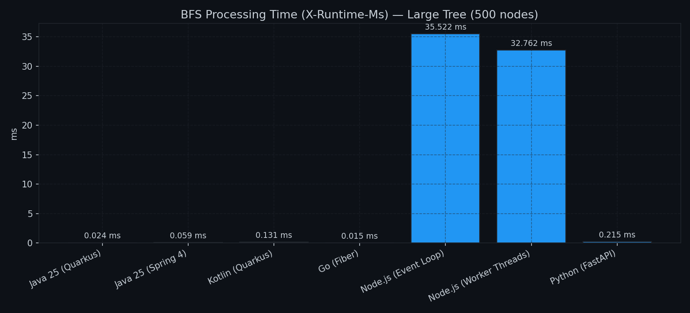

The BFS time delta between Go/Java and Node.js (500 nodes: ~0.02 ms vs. 33–36 ms, ~1,500–2,000×) directly explains the throughput collapse under load. Python's 0.215 ms — Pydantic v2 (Rust core) + orjson — is competitive with JVM in isolation, but a single uvicorn worker cannot parallelize.

---

## 📈 AWS App Runner — Infrastructure Metrics (Heptathlon Window)

> CloudWatch metrics captured from App Runner during the full heptathlon run (14:36–16:22 UTC).

### Request Throughput & Response Codes

| Metric | Chart |
| :--- | :--- |
| **Request Count** (req/min per service) | 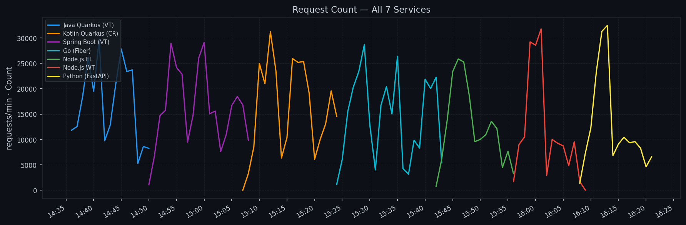 |

> All responses were HTTP 2xx. Zero 4xx or 5xx errors recorded across the entire heptathlon window.

### Resource Utilization & Concurrency

| Metric | Chart |
| :--- | :--- |
| **CPU Utilization** (%) | 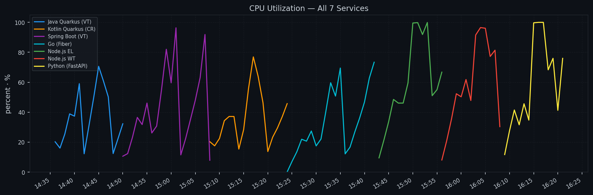 |
| **Memory Utilization** (%) | 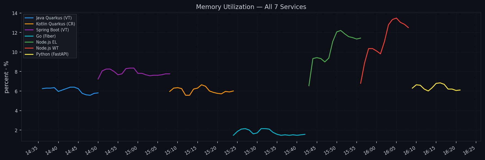 |
| **Active Instances** | 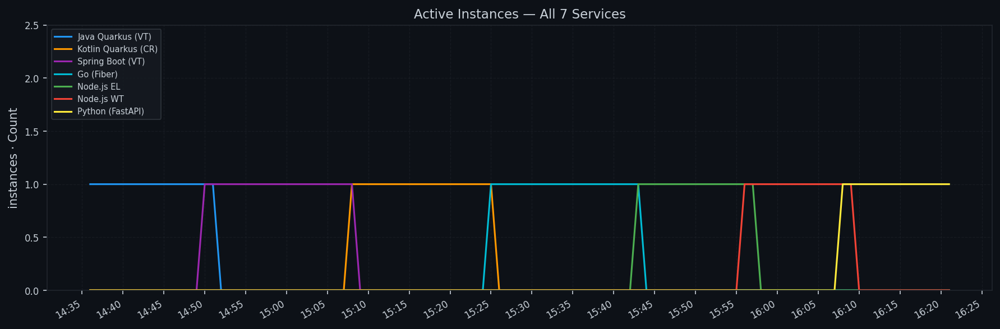 |
| **Concurrency at Instance** | 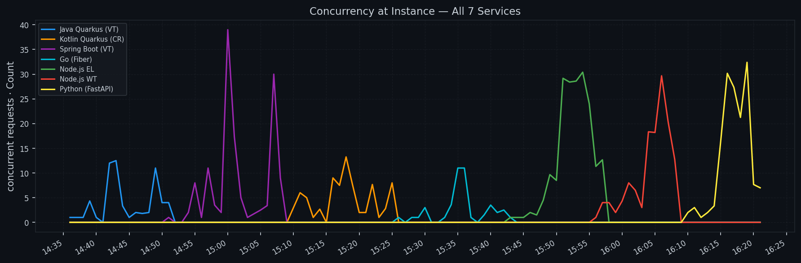 |
| **Request Latency p99** (App Runner view) | 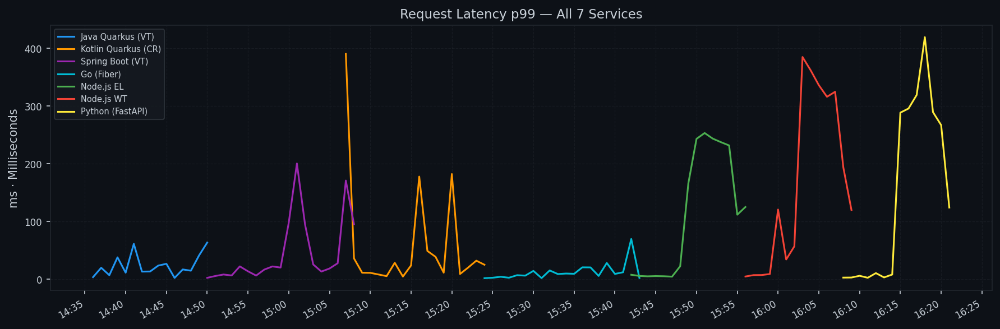 |

Key observations:
- **CPU** hits 100% on all services during the large-tree scenarios — confirming the workload is genuinely CPU-bound.
- **Memory** stays below 15% across all services — the 2 GB allocation is more than sufficient.
- **Active Instances** stays at 1 per service throughout — the interleaved methodology's lower per-service peak load (no simultaneous multi-service ramp) avoided auto-scaling events.

---

## 🛡 Security & Guardrails

All 7 implementations enforce identical multi-layer security constraints to prevent DoS via malicious payloads:

| Layer | Guard | Limit |
| :--- | :--- | :--- |
| **1a** | Content-Length / body size | 10 MB |
| **1b** | JSON nesting depth (pre-parse) | 1,000 levels |
| **2** | Structural validation (Pydantic / Jackson / Zod) | Schema conformance |
| **3** | BFS depth guard | 500 levels |
| **3** | BFS node-count guard | 10,000 nodes |

---

## 🚀 How to Reproduce

```bash
# 1. Deploy all 7 services to ECR + App Runner
bash scripts/deploy.sh all
bash scripts/create-apprunner-services.sh

# 2. Set service hosts (use the URLs from your own App Runner deployment)
export JAVA_HOST=<your-java-service>.us-east-1.awsapprunner.com
export SPRING_HOST=<your-spring-service>.us-east-1.awsapprunner.com
export KOTLIN_HOST=<your-kotlin-service>.us-east-1.awsapprunner.com
export GO_HOST=<your-go-service>.us-east-1.awsapprunner.com
export NODEJS_HOST=<your-nodejs-service>.us-east-1.awsapprunner.com
export NODEJS_WT_HOST=<your-nodejs-wt-service>.us-east-1.awsapprunner.com
export PYTHON_HOST=<your-python-service>.us-east-1.awsapprunner.com

# 3. Launch EC2 benchmark client (t3.medium, Amazon Linux 2023, same region)
#    Requires: wrk2, python3, pandas, matplotlib

# 4. On EC2: run combined heptathlon (Phase 1 + Phase 2 interleaved per service)
nohup python3 -u scripts/heptathlon.py > heptathlon_run.log 2>&1 &
tail -f heptathlon_run.log   # ~106 min

# 5. Copy results back
scp -i ~/.ssh/algo-benchmark.pem \
    ec2-user@<IP>:~/algo-test/{heptathlon_benchmark,heptathlon_saturation,heptathlon_probe}_2026.csv .
scp -i ~/.ssh/algo-benchmark.pem \
    "ec2-user@<IP>:~/algo-test/images/hepta_*.png" images/

# 6. Generate CloudWatch charts locally
python3 -c "
import datetime, sys; sys.path.insert(0, 'scripts')
import plot_cloudwatch, json
w = json.load(open('heptathlon_window.json'))
plot_cloudwatch.generate_all(
    start=datetime.datetime.fromisoformat(w['start']),
    end=datetime.datetime.fromisoformat(w['end']),
    prefix='hepta_'
)
"
```

Requirements: `wrk2`, `pandas`, `matplotlib`, `boto3`.

---

## 🏗 Infrastructure

| Component | Spec |
| :--- | :--- |
| **Services** | AWS App Runner — 1 vCPU / 2 GB RAM (us-east-1) |
| **Benchmark client** | EC2 `t3.medium` — 2 vCPU / 4 GB RAM (same region) |
| **Container registry** | Amazon ECR (7 repositories) |
| **Load tool** | `wrk2` — HDR histogram, constant-rate open-loop |

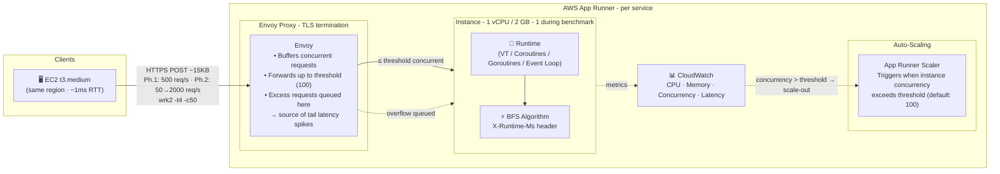

---

**Author:** Waldemar Quincke · [LinkedIn](https://www.linkedin.com/in/waldemar-quincke/)

